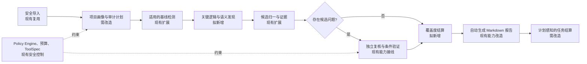
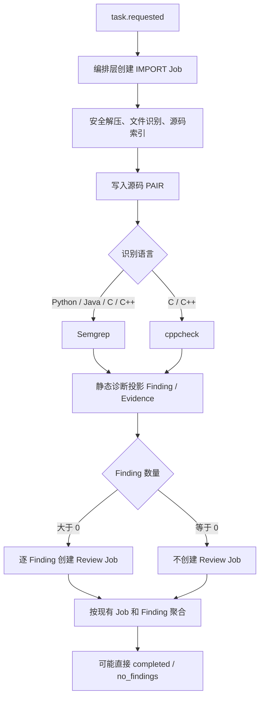
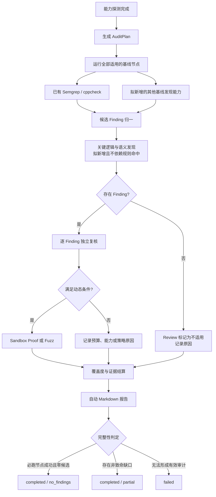

# ADR-021：源码审计基线与候选问题深审链路分离

- 日期：2026-09-10
- 状态：待评审
- 文档用途：问题与修改思路评审，尚未进入代码开发
- 决策负责人：项目负责人
- 主要评审人：编排、源码分析、安全策略和前端负责人
- 影响模块：M01、M07、M09、M11、M12、M13、M15、M16、M17
- 关联决策：ADR-018、ADR-019、ADR-020

> **建议采用“审计计划驱动的必跑基线 + Finding 驱动的条件深审”架构：规则是否命中只决定是否进入单个候选问题的复核与验证，不再决定整个源码审计任务是否结束。**

当前普通源码任务已经具备安全导入、源码索引、PAIR、Semgrep/cppcheck、候选
Finding 投影和独立复核等基础能力，但自动链路仍由少量静态规则的结果驱动。
当适用工具成功返回零诊断时，系统没有新的 Finding 可供复核，现有聚合逻辑便可以把
Task 结算为 `completed/no_findings`。这个结果只能证明已运行的现有规则没有命中，不能证明
原设计中的关键逻辑分析、语义审计、动态验证和报告链路已经执行。

目标方案把源码任务分成两个概念面：**基线审计面**负责完成对当前项目适用的检测、覆盖度
核算和报告，原则上每个合法源码任务都必须经过；**候选深审面**负责对已经产生的 Finding
进行独立复核、补充证据和按条件动态验证。系统只运行与输入语言和能力匹配的工具，纯 Python
项目不需要为了“链路完整”而运行 C/C++ 工具，也不通过制造无意义 Job 数量伪装审计深度。

图 1 是本 ADR 建议冻结的目标主链。审计计划由编排层拥有，执行 Worker 只执行被授权的
Job 并返回结构化结果；覆盖度和报告是任务结算的前置事实；动态验证仍只能通过独立
Sandbox Runner。图中“拟新增”表示当前主线没有相应的普通源码任务能力，不能在评审通过前
描述为已交付。

## 要解决的决策问题

本 ADR 请求负责人确认一个核心决策：**普通源码任务应当由持久化审计计划决定何时完成，
而不是由当前已经创建出来的 Job 和 Finding 数量隐式决定何时完成。**

目标不是让每个任务机械地显示更多步骤，而是保证用户能够回答下面三个问题：

1. 这个源码包实际执行了哪些检测？
2. 哪些检测不适用、不可用或因策略与预算被跳过，原因是什么？
3. `no_findings` 表示完整基线范围内没有候选问题，还是只表示某个工具零命中？

本次只形成待评审方案，不修改生产代码，不选择和引入新的第三方扫描器，也不声称新增检测
能力已经可用。具体 Schema、迁移、工具选型、接口和测试要等本 ADR 评审通过后再进一步确定。

## 当前系统实际上做了什么

### 当前自动链路

图 2 描述的是 `main@34a3779` 的普通源码任务事实。`IMPORT` 在一个 Job 内完成安全导入、
索引和 PAIR 写入；随后由 `SourceImportExecutor` 内部调用 `StaticAnalysisScheduler` 创建静态
分析 Job。最后一个源码分析 Job 结束时，`TaskAggregateSettlementHook` 把当前 Finding ID
列表交给 `ReviewJobScheduler`，后者只会为列表中实际存在的 Finding 创建复核 Job。

当前 `aggregate_task` 只观察已经存在的 Job、Finding 和 Poc。系统没有一份“这个 Task 原本
还应该执行哪些节点”的持久化计划，因此在零 Finding、零待运行 Job 时，没有事实阻止 Task
进入终态。

### 当前已经实现的源码检测项目

以下只列当前主线中真实存在的源码漏洞检测能力，不把规划中的能力写成现有检测项：

| 当前能力 | 适用范围 | 现在会检查什么 | 自动链路状态 |
|---|---|---|---|
| Semgrep 固定规则 | Python | 直接调用 `eval(...)`，规则 `vulnweaver.python.eval`、CWE-95 | 已自动接入 |
| Semgrep 固定规则 | C/C++ | 调用 `strcpy(...)`，规则 `vulnweaver.c.unsafe-strcpy`、CWE-120 | 已自动接入 |
| cppcheck `--enable=all` | C/C++ | cppcheck 当前版本能够产生并被适配器解析的诊断 | 已自动接入 |
| 静态诊断归一 | 上述工具产生的诊断 | 去重并投影为候选 Finding、工具 Evidence 和 PAIR 位置快照 | 已自动接入，但它不独立发现漏洞 |
| 独立模型复核 | 已存在的 Finding | 检查候选的事实、位置、证据和结论，受 FindingPolicy 约束 | 已自动接入，但零 Finding 时不会运行，也不是全仓发现器 |

安全解压、语言识别、函数与调用关系索引、源码 PAIR 是后续检测的分析基础，不属于独立漏洞
检测项目。它们已经自动运行，但其成功不能代替漏洞检测覆盖度。

### 已有相邻能力为什么没有出现在当前自动链中

| 相邻能力 | 最新主线状态 | 与普通源码任务的关系 |
|---|---|---|
| Markdown/PDF/SARIF 报告 | 已有 Report Job、Worker 路由和 API/Web 入口 | 当前由用户另行发起，不是每个源码 Task 结算前的自动节点 |
| Proof/Exploit | 已有 Job、API、Worker、Sandbox 客户端和策略门禁 | 针对指定 Finding 手动发起，不是零 Finding 时的检测器 |
| Sandbox Runner | 已有独立服务和隔离运行边界 | 提供动态执行基础设施，本身不主动决定扫描对象 |
| AFL++/CASR Fuzz 基础 | 已有预算、输入包、Runner 调用和崩溃分诊代码 | 尚未接入普通源码 Task 的自动调度与最终结算 |
| 二进制分析 | 已有 ELF/PE 解析与 PAIR 能力，部分工具仍待真实验收 | 属于二进制输入分支，不应算作当前源码包检测项目 |

因此，最新主线已经比截图对应版本多了报告、Proof/Exploit 和 Sandbox 服务，但“已有代码”不等于
“普通源码包已经自动走过这些阶段”。

当前事实的主要代码入口如下：

- 固定 Semgrep 规则：[`../../deploy/tool-specs/semgrep-rules.yml`](../../deploy/tool-specs/semgrep-rules.yml)
- 源码导入后的静态调度：[`../../packages/source-analysis/src/vulnweaver_source_analysis/executor.py`](../../packages/source-analysis/src/vulnweaver_source_analysis/executor.py)
- Semgrep/cppcheck 选择：[`../../packages/source-analysis/src/vulnweaver_source_analysis/static_executor.py`](../../packages/source-analysis/src/vulnweaver_source_analysis/static_executor.py)
- Finding 驱动的 Review 调度：[`../../packages/orchestrator/src/vulnweaver_orchestrator/review_jobs.py`](../../packages/orchestrator/src/vulnweaver_orchestrator/review_jobs.py)
- 当前任务聚合：[`../../packages/domain/src/vulnweaver_domain/aggregation.py`](../../packages/domain/src/vulnweaver_domain/aggregation.py)
- 手动报告入口：[`../../apps/api/src/vulnweaver_api/app.py`](../../apps/api/src/vulnweaver_api/app.py)

## 为什么不能继续保持现状

### 零命中被解释成了任务级结论

工具成功退出和零诊断只说明该工具按照当前配置执行成功。以当前 Python 路径为例，源码中没有
直接 `eval(...)`，即可得到零 Semgrep 诊断。此时没有 Finding，Review 调度循环为空，任务聚合
又看不到任何未来计划节点，于是可能快速结束。

问题不在于 Review 应该在零 Finding 时强行复核一个不存在的漏洞，而在于系统缺少一个与
Finding 无关的**基线发现阶段和覆盖度门禁**。复核只能复核已有候选，不能承担完整仓库发现职责。

### 编排决策分散，无法表达完整任务图

现在首个 Job 由编排服务创建，但后续静态 Job 由导入执行器调度，Review 又由 Worker 结算钩子
调度。执行器、结算器同时承担了部分“下一步做什么”的决策，编排层无法持有完整任务图，也就
无法在任务结束前确认计划是否真正执行完毕。

### `no_findings` 缺少覆盖度前提

当前 Task 结果只有实际 Job 是否失败、是否存在 Finding/Poc 等事实，没有以下任务级事实：

- 哪些语言和文件属于审计范围；
- 为这些语言计划了哪些检测阶段；
- 各阶段是成功、不适用、不可用、失败还是被策略跳过；
- 有多少源码未解析、未被任何检测器覆盖；
- 报告是否已经固化了限制和未覆盖范围。

因此当前 `no_findings` 最多应理解为“已运行工具零诊断”，不应直接对外表达成完整审计结论。

### 增加更多规则不能单独解决问题

扩充 Semgrep 规则能够提高候选召回，但只要任务结算仍然不知道“计划中应该有哪些阶段”，
任何规则缺口、工具不可用或语言覆盖缺口仍可能被零诊断掩盖。目标改造必须先解决调度与结果
语义，再逐步扩充检测面。

## 系统必须怎样运行

### 用审计计划定义“完整”，而不是用 Finding 定义“继续”

目标系统在安全导入和能力探测后，由编排层生成一份可持久化、可回放的 `AuditPlan`。名称和
Schema 可在详细设计阶段调整，但它至少需要表达：

| 计划字段 | 作用 |
|---|---|
| 阶段标识与依赖 | 明确什么完成后才能创建下一批 Job |
| 适用性 | `applicable`、`not_applicable` 及原因 |
| 完成要求 | 必跑、条件运行或仅用户请求 |
| 工具与配置身份 | ToolSpec、规则包版本、模型档位和预算 |
| 执行结果 | 成功、失败、不可用、跳过及结构化原因 |
| 覆盖摘要 | 计划文件、已解析文件、已扫描文件和未覆盖范围 |

`AuditPlan` 由编排层拥有并写入 PostgreSQL/检查点；Worker 不能修改计划含义，只能返回某个
计划节点的结构化结果。Task 聚合必须同时读取计划节点和实际 Job：计划中的必跑节点没有进入
终态时，Task 不得完成。

### 基线审计与候选深审采用不同触发条件

图 3 说明触发边界。基线节点由输入能力触发，不由规则命中触发；Review 仍然只处理真实
Finding；Proof/Fuzz 由 Finding、构建能力、项目开关和动态预算共同决定；Exploit 继续只允许
`confirmed` Finding 且项目显式开启。跳过不需要创建伪 Job，但必须在计划和界面中留下可解释
状态。

目标基线中除现有 Semgrep/cppcheck 外，建议新增的能力类别为：规则覆盖扩展、敏感信息发现、
依赖风险发现、配置风险发现、关键逻辑识别、数据流/语义候选发现和覆盖度汇总。这些均是
**拟议能力**，具体工具、规则来源、许可证、固定版本和供应链策略不在本 ADR 中提前决定。

语义发现与独立复核必须是两个隔离角色：语义发现可以在零规则命中时从入口点、危险操作和
PAIR 邻域提出候选；独立复核只接收可验证事实与必要上下文，检查候选前提和证据一致性。两者
均不能凭模型解释单独把 Finding 标记为 `confirmed`。

### 单语言项目如何走完整链路

以纯 Python 项目为例，目标行为应为：

1. 安全导入、Python 文件识别、源码索引和 PAIR 成功；
2. 审计计划把 Python 相关基线节点标记为适用，把 cppcheck 标记为 `not_applicable`；
3. 执行现有 Python Semgrep，并在后续阶段逐步执行已经交付的其他 Python 基线发现能力；
4. 即使 Semgrep 零命中，也执行关键逻辑/语义发现和覆盖度汇总；
5. 没有 Finding 时不创建 Review Job，但记录“无候选问题，复核不适用”；
6. `max_dynamic_runs=0` 时记录“动态预算关闭”，不执行动态样本；
7. 自动生成 Markdown 结果报告；
8. 只有计划中的必跑节点成功且覆盖度门禁通过，才允许 `no_findings`。

因此，不要求 Python 和 C 同时存在，也不要求为了展示流程而运行不适用的扫描器。

## 结果与失败语义

| 结果 | 目标判定条件 | 用户应看到的解释 |
|---|---|---|
| `NO_FINDINGS` | 所有适用的必跑基线节点成功、覆盖度门禁通过、自动报告成功，且没有 Finding | 在明确覆盖范围内未发现候选问题；同时列出不适用节点 |
| `SUCCESS` | 必跑基线完整，存在已记录的 Finding/证据结果，自动报告成功 | 已完成审计；按 Finding 状态展示候选、确认、误报或争议 |
| `PARTIAL` | 至少形成有效分析，但必跑节点失败/不可用、覆盖度不足、语义发现未执行或报告失败 | 审计部分完成；不得使用无条件“未发现漏洞”措辞 |
| `FAILED` | 导入、计划生成或最低有效检测均无法完成 | 未形成可用审计结果，展示结构化失败原因 |

策略明确关闭的可选动态节点不自动导致 `PARTIAL`；但节点必须显示为“按配置不适用”。如果用户
选择了包含动态验证的审计模式，而对应必需动态节点因环境不可用未执行，则结果应为 `PARTIAL`。

自动报告建议默认只生成 Markdown，PDF/SARIF 继续按用户请求生成，避免把格式转换失败扩大为
所有任务的主链风险。Markdown 报告必须包含工具与规则版本、文件覆盖、失败/跳过原因、Finding、
证据、复核结果和限制说明。

## 责任边界和安全约束

- 编排层拥有 `AuditPlan`、节点依赖、后续 Job 创建、预算分配和完成门禁。
- Worker 只执行固定 ToolSpec 对应的结构化 Job，不选择下一阶段，不提供任意命令。
- PostgreSQL 和不可变工件存储继续作为计划、结果、证据和报告的事实来源。
- Redis 只负责至少一次消息投递，不作为审计计划和完成状态事实来源。
- 静态工具和模型输出均视为不可信数据，只能形成候选或证据，不能改变策略。
- 所有动态执行继续只经过独立 Sandbox Runner，默认禁网、非 root、只读输入并限制资源。
- Exploit 继续要求 Finding 已确认、项目显式开启且策略允许，本 ADR 不放宽现有门禁。
- 本 ADR 只适用于用户授权的源码任务，不扩大样本授权边界。

## 固定的目标决策与取舍

| 决策点 | 目标方向 | 理由与后果 |
|---|---|---|
| 审计完成依据 | 使用持久化 AuditPlan + 实际 Job 结算 | 防止尚未创建后续 Job 时提前完成；需要新增计划事实和聚合逻辑 |
| 基线与深审触发 | 基线按输入能力必跑，深审按 Finding 和策略运行 | 零规则命中不再截断发现链；不强行复核不存在的 Finding |
| 调度所有权 | 后续管线决策收回编排层 | Worker 保持单一执行职责；需迁移现有导入/结算钩子中的调度责任 |
| 单语言处理 | 只运行适用检测，不要求多语言同时出现 | “完整”由适用性和覆盖度定义，不由 Job 数量定义 |
| 模型角色 | 新增语义发现角色，保留隔离的独立复核角色 | 提高规则外候选召回，同时不破坏强证据确认门禁 |
| 报告触发 | Markdown 自动，PDF/SARIF 按需 | 每个 Task 都有可读结论，且不让格式转换成为默认主链单点失败 |
| 历史任务 | 不回写旧 Task，新任务使用新计划语义 | 保留审计历史，避免无证据改写既有结果 |

不采用“只增加更多 Semgrep 规则”的方向，因为它无法解决计划缺失和结果语义问题；也不采用
“零 Finding 时强制运行 Review”的方向，因为 Review 的输入是具体候选事实，不能用空输入替代
仓库级语义发现。

## 当前能力如何演进到目标状态

| 能力或组件 | 当前状态 | 目标处理 | 主要落点 |
|---|---|---|---|
| 安全导入、源码索引 | 已实现、可复用 | 保持执行能力，移除其后续管线决策职责 | source-analysis、orchestrator |
| 源码 PAIR | 已实现、可复用 | 作为语义发现、复核和覆盖度的统一事实输入 | pair、orchestrator |
| Semgrep/cppcheck | 已实现但检测面窄 | 作为基线检测器保留，并逐步扩展规则覆盖 | source-analysis、tool-specs |
| Finding/Evidence 投影 | 已实现、可复用 | 接收所有基线与语义发现来源，保持去重和谱系 | source-analysis、persistence |
| Independent Review | 已实现、可复用 | 仍由 Finding 触发，不作为仓库级发现器 | orchestrator、model-gateway |
| AuditPlan/覆盖度 | 当前缺失 | 新增计划事实、节点状态、覆盖摘要和完成门禁 | contracts、persistence、orchestrator |
| 仓库级语义发现 | 当前缺失 | 新增独立于 Review 的候选发现角色 | orchestrator、model-gateway、pair |
| 其他基线发现能力 | 当前缺失 | 按详细设计确定工具后分阶段接入 | source-analysis、tool-specs |
| 报告 | 已实现，当前按需创建 | 自动创建 Markdown；PDF/SARIF 保持按需 | reporting、orchestrator、web |
| Proof/Exploit | 已实现主要代码，待完整 E2E | 作为 Finding 条件分支接入计划，不放宽策略 | proof、sandbox-runner |
| Fuzz | 有基础实现，未接普通源码自动链 | 仅在能力、预算和策略满足时进入动态分支 | fuzzing、sandbox-runner、orchestrator |
| 任务页 | 已展示 Job/Finding/报告入口 | 增加计划节点、覆盖度和跳过原因 | api、web |

## 实施路线

| 阶段 | 交付内容 | 退出条件 |
|---|---|---|
| 1. 计划与结算完整性 | AuditPlan/节点状态、编排层统一调度、覆盖摘要、自动 Markdown、计划感知聚合 | 零 Finding 不会在必跑节点完成前结束；工具缺失返回 `partial` |
| 2. 基线检测扩展 | 评审并接入规则覆盖、敏感信息、依赖和配置风险等新增能力 | 每项能力有固定版本、ToolSpec、正反例、失败语义和覆盖记录 |
| 3. 关键逻辑与语义发现 | 入口点/危险操作标定、PAIR 邻域、函数级数据流摘要、独立语义发现 Agent | 零 Semgrep 命中样本仍能执行语义发现；模型只产生 candidate |
| 4. 动态条件分支 | 将现有 Sandbox、Proof 和 Fuzz 能力接入 AuditPlan | 预算/策略允许时可回放；禁止条件均被对抗性测试拦截 |
| 5. UI 与全链验收 | 计划、覆盖度、跳过原因、Finding、证据和报告统一展示 | 单语言正反例、失败注入、重放和浏览器 E2E 通过 |

阶段 1 必须先于新增扫描器完成，否则检测面扩大后仍可能继续产生误导性的任务级结论。每个阶段
应独立提交、独立验收，不在一个实现 PR 中同时完成全部能力。

## 后续开发的验收门禁

评审通过后的实现至少要证明：

1. 纯 Python、且不包含直接 `eval(...)` 的无害样本仍会完成全部适用基线节点、覆盖汇总和
   Markdown 报告；cppcheck 明确显示为不适用。
2. 包含直接 `eval(...)` 的固定样本能够生成 Finding/Evidence，并且只为该 Finding 创建独立
   Review Job。
3. Semgrep 不可用、规则输出损坏、解析覆盖不足或必跑语义发现不可用时，Task 不得返回
   `no_findings`，应为可解释的 `partial` 或 `failed`。
4. 零 Finding 不创建虚假的 Review/Proof/Exploit Job，但计划中记录每个条件节点未运行的原因。
5. `max_dynamic_runs=0` 的项目不会执行样本；启用动态模式后，所有运行只经 Sandbox Runner，
   现有禁网、只读、非 root、镜像摘要和资源门禁不得回退。
6. 重复消息、Worker 崩溃和编排恢复不会重复创建等价计划节点、Finding、Review 或报告。
7. 自动报告能够明确回答已扫描范围、未覆盖范围、工具/规则身份、候选与复核状态，不使用超出
   证据范围的“项目无漏洞”结论。
8. 对抗性审查能够区分“零命中”“工具没运行”“规则不适用”“输出不可解析”和“覆盖不足”。

## 待评审决定

| 待决定事项 | 推荐默认值 | 选择其他方向的影响 |
|---|---|---|
| 语义发现是否属于默认必跑基线 | 是；模型未配置或预算为零时结果为 `PARTIAL` | 若设为可选，`NO_FINDINGS` 只能代表工具基线，不得称为完整语义审计 |
| 自动报告格式 | 默认自动 Markdown，PDF/SARIF 按需 | 全格式自动会增加耗时和格式转换失败对主链的影响 |
| 覆盖度门禁阈值 | 先采用“所有识别出的支持语言文件都有明确解析/跳过结果；任何未知高风险入口导致 `PARTIAL`”，数值阈值通过样本实验确定 | 直接固定百分比可能掩盖少量但关键的入口文件，也可能被大型生成文件扭曲 |
| 新增规则和扫描器来源 | 固定版本、可离线回放、许可证与来源可审计后接入 | 在线临时拉取规则会破坏复现性并扩大供应链风险 |
| Fuzz 是否作为默认源码基线 | 否；仅在项目可构建、预算大于零且策略允许时进入条件分支 | 默认运行会显著增加资源消耗，也无法覆盖不可构建项目 |

上述推荐默认值已经用于本文目标主链。负责人可以批准、要求修订或否决；在 ADR 状态改为
“已接受”之前，不得把本方案当作已生效决策，也不进入完整接口、迁移和工具选型设计。

## 评审结论记录

- [ ] 同意“基线必跑、Finding 条件深审”的总体边界。
- [ ] 同意由编排层持有 AuditPlan 并作为 Task 完成门禁。
- [ ] 同意语义发现与独立复核使用隔离角色。
- [ ] 同意自动 Markdown、PDF/SARIF 按需的报告策略。
- [ ] 同意实施路线和验收门禁。
- [ ] 要求修改后再次评审。
- [ ] 不接受，原因：

当前结论：**待评审；详细实现和生产代码开发均未开始。**
