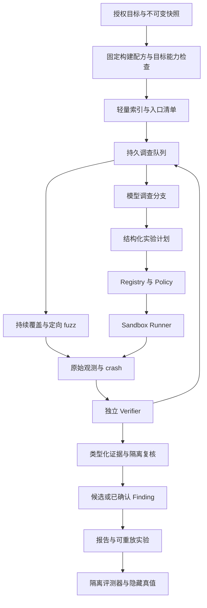

# 面向真实世界 benchmark 的架构改进方案

日期：2026-10-03。状态：架构方向已接受，阶段性安全修复实施中；目标绑定和 benchmark 尚未实现、未运行。代码基线为 `efdeb83`；已确认缺陷见 [代码审查](code-review-2026-10-03.md)，重大接口变更决策见 [ADR-036](adr/036-target-bound-verification-and-benchmark-evaluation.md)。下文的验收条件是未来工作要求，不是已有性能结果。

## 1. 结论与能力边界

保留 PostgreSQL、CAS、Outbox、租约 Worker、Tool Registry、Policy Engine 和 Sandbox Runner。重建三个核心环节：**真实目标构建、围绕可证伪假设的调查、独立判定的验证**；增加与调查隔离的评测面。继续增加模型轮次、语言数量或反编译工具，不能解决目前结果缺乏目标绑定的问题。

前次 CR-01 至 CR-08 均未修复。修完它们只能恢复基本可信度，不能自动获得真实项目挖掘能力。本轮补充检查发现：`analysis-worker/main.py::_fuzz_target` 给模型的是源码摘录，并要求生成独立 harness；`fuzzing/job_executor.py::execute` 将执行输入替换为编译后的 harness；`fuzz-tool/vulnweaver-fuzz-entrypoint` 的 harness 编译只编译 `harness.c`，未在该路径构建、链接原项目。这能测试生成程序，却不足以证明原项目存在相同漏洞。这个能力缺口也必须进入第一阶段。

首个目标范围应是 **Linux 用户态 C/C++ 项目、可固定构建、存在输入接口的解析器或库**。优先复用 benchmark 提供的原项目 fuzz target；随后扩展浏览器用户态和 Web 逻辑缺陷。语言能索引不等于漏洞能验证。PE 静态分析能力不等于 Windows 原生动态验证能力；Linux 内核 benchmark 当前不符合既定沙箱边界，应明确记为不支持。

## 2. 评测任务不能混为一谈

| 任务 | 实际检验什么 | 本系统应如何使用 |
|---|---|---|
| [CyberGym](https://github.com/sunblaze-ucb/cybergym) | 根据漏洞描述和目标源码生成复现输入，服务端区分漏洞版、修复版执行结果 | 已知线索复现轨；固定难度、提示集合和目标版本，不能把此成绩称为盲发现能力 |
| [CyberGym-E2E](https://github.com/sunblaze-ucb/cybergym-e2e) | E2E 模式仅给源码，要求发现、PoC、补丁；官方还检查补丁后 PoC、功能测试及隐藏真值 PoC | 盲发现主轨；只完成发现和原版复现时报告该阶段结果，不能宣称完成官方 E2E 四阶段 |
| [VulnGym](https://github.com/Tencent/VulnGym) | 项目级入口与关键操作定位；官方匹配文件和两端行号，主要计召回 | 检验跨函数调查；沿用官方匹配，同时额外审查误报和未知候选，不能靠大量报告刷召回 |
| [SEC-bench Pro](https://github.com/SEC-bench/SEC-bench-Pro) | 已公开报告驱动的 V8、SpiderMonkey、内核复杂漏洞复现 | 后续复杂复现轨；内核要求 privileged 与 KVM，当前排除，不能绕过安全规则接入 |

CyberGym-E2E 的官方四步是：PoC 在原版触发、在 agent 补丁版不触发、功能测试通过、隐藏真值 PoC 在补丁版不触发。patch-only 模式提供的线索更多，必须分开计分。VulnGym 的 [官方评测器](https://github.com/Tencent/VulnGym/blob/main/examples/evaluate.py) 对入口和关键操作采用行号容差，trace 不参与匹配，且召回口径不惩罚乱报。因此官方成绩和我们补充的证据质量成绩都要保留。

外部系统提供的是方法参考：[Buttercup](https://github.com/trailofbits/buttercup) 将 program model、seed generation、fuzzing、patching 分工；[Atlantis 的团队技术总结](https://team-atlanta.github.io/blog/post-afc/) 把传统 fuzz、定向 fuzz、符号技术与模型生成种子组合使用。这支持“模型安排实验、工具提供观测”的设计方向，不能证明照搬后本项目一定更强，也不要求复制其基础设施或代码。

## 3. 目标架构与完整数据流

这些是职责边界，第一版仍可部署在现有 Worker 和编排服务中。不要先拆十几个微服务。执行面维持现有安全属性，模型始终只能提出经过验证的结构化 ActionPlan。

### 3.1 先建立真实目标，而不是先生成脚本

新增 `TargetSnapshot`：源代码/二进制摘要、项目版本、目标平台、依赖快照、构建配方版本、工具链镜像摘要、编译配置。构建产物另有身份，并记录父快照。每个实验都绑定快照、构建产物、harness、输入和验证器版本。

构建配方由登记的 BuildProfile 定义参数和输出，模型不能提交任意 shell 字符串。项目构建脚本也属于不可信目标代码，只能经 Sandbox Runner 执行。依赖从预置镜像或已授权的离线 CAS 包提供，构建缺依赖时明确失败；不为方便打开样本网络。

优先使用现有单 `input_ref` 协议承载**有版本的 ExecutionBundle**：包含 manifest、原目标、驱动及输入。Runner 校验摘要、成员逻辑路径、项目授权和 profile；限制路径穿越、符号链接逃逸和未声明成员。profile 负责固定 argv，保持宿主路径不可控。先复用现有 bundle 模式，确需新增协议时同步 Schema、消费者和契约测试。

生成驱动与元数据分离；驱动是独立 DERIVED 工件，父关系指向目标，绝不推进原样本的 `current_version_id`。harness 必须链接原目标代码或调用原目标程序；不能把模型重写的漏洞函数当原目标。记录链接输入、源码摘要和构建输出；先跑正常输入 smoke test，再启动 fuzz。

### 3.2 调查的基本单位改为可证伪假设

引入 `InvestigationCase`，至少记录：

- 精确目标版本、入口、缺陷操作的文件/行/地址锚点及已读取内容引用。
- 违反的约束、攻击者能控制的输入、必要前置条件、入口到缺陷的路径主张。
- 支持与反对证据、尚未证明的环节、预期可观测结果、下一项实验。
- 已执行实验、失败原因、停止原因、恢复检查点及去重键。

候选身份使用“目标快照 + 缺陷精确位置 + 被违反约束”，不能继续用“函数 + CWE”合并不同问题。报告门禁检查引用确实来自本版本已读代码；引用只证明调查依据存在，不证明漏洞成立。入口和缺陷位置分别存储，使 VulnGym 的两端定位有实际数据来源，局部邻域不能冒充完整可达路径。

Coordinator 维护持久调查队列，静态工具、模型搜索、入口清单、fuzz crash 都能创建或更新调查。保留一部分探索机会给没有 scanner 提示的入口，避免只验证已知规则。相互隔离的调查分支共享有来源的事实，不直接共享另一分支的结论。分支数量通过等成本实验决定，不能预设多智能体更有效。

fuzz 应在构建就绪后持续运行，不必等待已确认 Finding。候选 PoC 可以测试假设；exploit 仍仅处理 confirmed 且项目显式开启的 Finding。已有 crash 即使还没有 Finding 也需独立登记，再由调查关联，不能因为缺 finding_id 丢失发现入口。

### 3.3 把工具成功、漏洞触发和可利用性彻底分开

新增独立 `VerificationObservation` 与 Verifier Registry。至少区分：`VERIFIED_TRIGGER`、`REJECTED_UNDER_TEST_CONDITIONS`、`INCONCLUSIVE`、`ENVIRONMENT_ERROR`。Job/Sandbox 成功只表示执行完成，不自动产生上述漏洞结论；未触发只否定本次条件，不宣布整个目标安全。

验证器由系统登记，模型不能修改判据或选择任意观测布尔值。原始观测包含目标/build ID、输入摘要、执行环境、真实进程结果、sanitizer/堆栈或客观业务效果、正常输入对照及重放记录。模型脚本打印的 `source_marker`、`sink_marker`、`success` 等仅作为不可信主张，不得直接升格为 STRONG 事实。观察组件、解析器和结果通道不能由模型驱动覆盖；目标 stdout 也可能伪造，应交叉核对进程、栈和目标身份。

| 漏洞类型 | 第一版可接受的证据 | 不足以确认的输出 |
|---|---|---|
| C/C++ 内存错误 | 原目标执行中的 sanitizer/异常与目标栈，固定输入重放，对照输入不触发，关联实际缺陷位置 | harness 自己崩溃、仅退出码、模型生成的 crash 文本 |
| 注入 | 本地隔离环境里受控输入确实影响独立观察的危险操作，并验证有关防护约束 | 驱动自行声称 source 到 sink 已发生 |
| 鉴权缺陷 | 登记的身份/权限夹具与约束模型，观察未授权主体实际读写受保护对象 | 模型解释“看起来无鉴权”或泛化的 constraint_analysis 字符串 |

初期确定性案例可要求独立重放 3/3；竞争、时间相关案例记录触发频率和条件，不套用相同规则。sanitizer 触发是内存缺陷证据，不等于攻击者控制执行流。可利用验证有另一个效果判据和授权门禁。

`DerivedFact` 从验证器产物推导，保留来源、工具版本、父证据和政策版本，替代易丢失又易伪造的自由字符串白名单。独立复核使用隔离上下文核查根因、适用范围和反例，不能替代客观执行证据。没有合适独立判据的逻辑漏洞保持候选，进入人工复核。

### 3.4 让检索成本随调查范围增长

PAIR 保留轻量符号、调用边和位置索引，函数正文/伪代码按需读取；邻域查询在数据库按版本、节点和方向分页扩展，不在每次调用中下载全图。搜索先去重文件，再计文件预算。二进制先建立快速入口索引，对选中函数逐步反编译，不把全量反编译变成每次调查的前置阻塞。

引入 `CoverageManifest`：已识别/索引/读取/路径检查/动态测试的范围，以及截断、跳过、失败和不支持原因。分母未知时写未知；分析状态 complete 不再暗示整个程序已覆盖。缓存键包括输入摘要、工具/配置/Schema，不能沿用过期的调查结论。

调查台账是数据库记录，提示词只携带当前子问题和相关检索结果。有界 journal 用于提示上下文，不能充当长期事实来源。项目记忆绑定目标版本；跨版本结论先失效再重验。benchmark 运行用独立命名空间，禁止上一任务的隐藏答案进入下一任务。

## 4. 评测面与性能诊断

每个 `BenchmarkTask` 固定 `agent_visible` 和 `grader_only` 两类数据。已知报告轨允许的描述、盲发现轨禁止的 PoC/补丁/崩溃日志均由 adapter 按官方任务协议控制；真值只能由隔离 grader 使用。评测器不能作为 Agent 可调用的答案查询工具。训练集污染无法完全排除，要报告时间范围、提示来源和项目划分。

记录漏斗：可加载 → 构建成功 → 提出候选 → 找到真实路径 → 原目标触发 → 独立重放 → 根因通过复核；官方 E2E 另记录补丁和功能测试。每步失败留在分母与结构化原因中，不能删除构建失败样本后宣称全 benchmark 成绩。兼容子集结果明确标注子集与选择条件。

核心指标是官方成功率/召回、经审查的候选质量、首次有效发现时间、每个有效发现的总成本、重放成功率、构建成功率。未知候选不自动当误报：真值不完整，需独立判定。修复版仅是对应缺陷的负对照，不是整个项目“无漏洞”标签。

模型、提示、配置、工具镜像及任务版本固定；预设总时间/调用成本与停止条件，失败重试同样计费；区分冷构建与热缓存，报告端到端和构建后成本。建议关键试验每任务三次并保留全部结果，以项目为单位划分调参与评测集合。控制面的评测时间/成本限额不改变 ADR-025 的容器资源策略；不新增容器 CPU、内存、进程、磁盘、输出配额。

做等预算消融：静态工具、fuzz、最小源码读取 Agent、组合系统；再比较调查台账、定向 seed、不同分支数的增益。先建立基线，再设提升目标，不凭空承诺成功率。

| 可能瓶颈 | 已有代码依据或风险 | 必须收集的证据 | 改进方向 |
|---|---|---|---|
| 邻域与启动加载 | CR-07 全图查询、重复全量函数加载 | 每查询 SQL 行数/字节、P50/P95、RSS、每任务调用数 | 索引查询、分页、正文按需获取 |
| 大二进制准备 | CR-08 上限截断；完整导入可能长期阻塞 | 各工具耗时、可用首批符号时间、截断范围 | 快速索引、选中函数反编译、分阶段产物 |
| 模型回合 | 当前执行循环顺序调用；摘要可能导致重复调查 | 首个有效候选前轮次、重复工具比例、token、等待耗时 | 持久假设、精简检索、可独立 Job 并行 |
| 构建/harness | 当前源码路径编译独立生成程序 | 原目标链接验证、构建成功率、harness 自身崩溃比例 | 固定真实构建，复用现有 fuzz target |
| 无收益动态测试 | 无覆盖反馈时 seed/目标可能无效 | 输入有效率、独立目标覆盖、路径到达率、有效触发/CPU 时间 | 输入格式种子、入口选择、定向反馈 |

上述性能瓶颈尚未量化；应在固定小/中/大目标上测量后再决定并发与缓存投入。覆盖增长只说明输入探索进展，不直接等于漏洞发现。

## 5. 实施顺序与验收

P0 的旧链路可信度修复已开始，目标绑定和真实目标闭环尚未完成。优先完成一个真实目标的闭环，再扩展规模。

| 阶段 | 具体工作 | 进入下一阶段的条件 |
|---|---|---|
| P0 结果可信度 | CR-01/02/03/04；独立驱动工件、ExecutionBundle、目标绑定、验证器与事实入库链 | 在 Linux 容器经真实 Runner：正常输入、空脚本、伪造成功标记、harness 自身崩溃均不确认；固定原目标正例可重放；原样本版本不变；证据到政策门禁真实 DB 回归通过 |
| P1 最小真实项目闭环 | 固定 1–3 个获授权开源解析器项目构建，复用原 fuzz target；接入已知复现与源码盲发现 adapter | 能从源码到原目标实验和独立评分；公开任务选择与所有失败原因；未构建原目标时不计动态发现成功 |
| P2 发现内核 | CR-05/06；入口与缺陷双锚点、假设队列、反例、crash 无 Finding 登记、覆盖台账 | 同函数两处缺陷不合并；跨文件搜索完整计数；无读代码引用不能报告；盲轨无隐藏数据访问；与简单基线等预算比较 |
| P3 效率与长线 | CR-07/08；局部图查询、按需正文/反编译、持续 fuzz、任务级实验预算与恢复 | 大目标不再单次查询全图；截断显式可见；崩溃/重复消息/租约接管不重复确认或丢证据；实测成本改善且有效发现不退化 |
| P4 扩展 | 按案例增补 Web 约束夹具、浏览器工具链、补丁验证、更多支持平台 | 每新增类别先有独立判据、真实正反例和公开支持矩阵；完成四阶段后才报告完整 E2E 成绩 |

首轮试验可选择约 20 个任务作为工程试点，覆盖不同项目和可验证缺陷，并添加对应缺陷的修复版对照。样本数是执行建议，不代表统计充分；正式比较需要更大、按项目隔离的集合和不确定性区间。首次验收重点是能否真实构建、触发、重放、拒绝伪证据，而非人为设一个漂亮成功率。

### 与现有模块的对应

- `contracts`：新增版本化 TargetSnapshot、ExecutionBundle、InvestigationCase、VerificationObservation、CoverageManifest；生成消费者和契约测试同步升级。
- `proof` 与 `proof-tool`：分离生成驱动、运行实验、可信判定；移除“退出成功就是 exploitable”的映射。
- `fuzzing` 与 `fuzz-tool`：目标构建/链接验证、输入反馈、原目标重放；独立 crash 工件。
- `orchestrator`：调查队列、候选精确去重、隔离复核和持久检查点；保留既有 Outbox/租约。
- `persistence`：索引式 PAIR 访问、调查与观测迁移、派生关系和版本不变量。
- `sandbox-runner`：登记 bundle/profile 的材料化和安全校验，维持唯一运行时访问者。
- benchmark adapter 与评分代码放在 `code/` 内，先检查既有职责再创建模块；隐藏真值与大型运行数据不提交仓库。

不先更换编排框架、Graph DB 或模型供应商，不先引入大量 analyzer。第一项可直接开始的开发任务是：为一个固定原目标设计 bundle 与 verifier 契约，补充空脚本/假成功/错误目标的真实 Runner 回归，再修复 CR-01 至 CR-04。这是后续任何成绩可信的前提。

## 6. 资料与证据边界

本方案核对了上述官方仓库、评测器和团队技术材料；[CyberGym 论文](https://arxiv.org/abs/2506.02548)、[SEC-bench Pro 论文](https://arxiv.org/abs/2605.26548)用于区分复现任务与盲发现任务。外部任务定义来自原始资料，当前系统缺口来自代码阅读，目标结构与实施顺序属于工程建议。尚未运行这些 benchmark、验证镜像兼容性或测量吞吐，不能将建议写为已交付能力。
