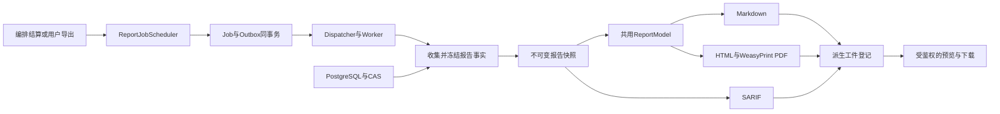

# M16 中文审计报告模块设计

- 日期：2026-09-11
- 状态：整体设计及 RPT-UI 实现说明；事实准确性、代码摘录与专业排版已落地，公共快照协议与报告版本方案仍见 [ADR-026（提议）](adr/026-report-snapshots-and-revisions.md)。
- 工作位置：`.worktree/task-reports`，分支 `feat/report-professional-layout`，实现基线 `348fbbc`。
- 任务范围：参考 DeepAudit 代码实现现有报告生成与专业中文排版；不设页数限制，截图仅为视觉参考。后文超出下列已落地范围的快照、版本及 Web 面板属于后续设计。
- 需求依据：[系统实现模块拆分 M16](../../系统实现模块拆分.md)、[系统架构 §6.5](../../系统架构设计与技术选型.md)、[ADR-021](adr/021-source-audit-baseline-and-finding-deepening.md)，以及用户给出的《大作业要求.txt》和 DeepAudit 报告参考图。

## 1. 目标与完成边界

### 本次已落地范围（2026-09-11）

- `content.py` 共用中文事实模型，`html.py`/`styles.py` 实现 A4 及屏幕布局：摘要卡、等级/状态统计、分级详情、源码/工具伪代码行号、证据文内跳转、完整修复建议与复核说明、页眉与总页码。内容自然分页，不按截图限制篇幅。
- `excerpts.py` 只读任务选定版本与可追溯派生版本；Worker 注入已有安全源码 Reader。二进制 PAIR 按原始输入查询图索引，但严格匹配 `binary_location.artifact_version_id`/已分析版本，避免去壳代码漏读与同地址串用。
- 正文保留执行摘要、风险统计、发现/等级/可信度/位置、调用路径、支持/反驳/上下文证据、影响分析、修复、动态验证和待确认项。类别影响与通用建议明确标记；无证据不伪称模型来源；误报不抬升风险；未结算/部分失败的空结果不判为低风险完成。
- 每段代码最多 80 行/16 KiB，摘录总预算 2 MiB，仅限制嵌入上下文，不限制报告页数；缺失或截断有说明。常见凭据赋值展示脱敏，来源版本与摘要仍保留。PDF 禁止外部资源请求，所有输入文本转义。
- 继续既有自动 Markdown、按需 PDF/SARIF、不可变 CAS 登记链路；生成配置记录 `template_version=2`。已生成的目标版本直接复用，拒绝任务/目标版本不匹配；本轮没有引入快照、迁移、新公共 Schema 或模型调用。
- Linux Dev Container 定向测试 79 passed；Ruff/Pyright 通过。真实二进制扫描及明确标为测试数据的空结果、源码、长代码/长复核 PDF 共 13 页完成视觉检查。未部署、未补全里程碑 E2E，也未将下文完整验收矩阵全部标为通过。

### 完整模块目标

报告应让读者在不读取数据库或原始日志的情况下，理解审计了什么、发现了什么、依据是什么、验证到哪一步、应该如何修复。正文可读，附录可追溯。源码与二进制共用一份事实模型，Markdown、PDF、SARIF 表达同一版本结论。

课程明确要求自动生成报告，并包含漏洞列表、严重等级、证据链、修复建议。结合系统既有能力，交付范围如下。

| 要求 | 报告中的落点 | 完成判据 |
|---|---|---|
| 自动生成结构化报告 | 基线及已调度深审收敛后自动生成 Markdown | 零发现也生成；保留已有 Job、Outbox、Worker 和结算门禁 |
| 漏洞列表、严重等级 | 发现索引、分级统计、逐项正文 | 区分已确认、待确认、误报；每项保留 Finding ID 与 CWE |
| 证据链 | 位置、源码/伪代码、调用路径、支持与反驳证据、复核与动态验证 | 正文的每项事实能定位到不可变输入或证据记录 |
| 修复建议 | 与问题代码相邻的中文建议及修复后验证方法 | 使用真实建议；缺失时明确标为通用建议，不能伪造已验证补丁 |
| 二进制逆向特色 | 识别、去壳、反编译、解混淆摘要及伪代码 | 区分原始件、脱壳件、工具伪代码、模型可读化文本 |
| 多智能体协作 | 审计过程摘要、角色与有记录的决策/输出 | 只展示持久化记录；无记录时不画虚构协作关系 |
| 可复核与可交付 | 人工复核历史、不可变报告版本、下载和预览 | 旧报告不随复核或新扫描静默改变 |

首版不引入代码质量百分制评分、CVSS 自动打分、合规认证、可视化模板编辑器、定时邮件或公开分享。严重等级和可信度来自原始 Finding，可信度不解释为统计校准后的真实概率。

## 2. DeepAudit 的参考依据与取舍

本地参考仓库：`D:/ruanchengyun/project/VulnerabilityMiningSystem/DeepAudit`，查阅提交 `324133f`。以下为代码事实，不能把参考项目的宣传语或模型结论当成 VulnWeaver 的验收结果。

| DeepAudit 代码入口 | 实际设计 | VulnWeaver 采用方式 |
|---|---|---|
| `backend/app/services/report_generator.py`：`_TEMPLATE` | A4、running logo、页眉、页码、摘要栏、等级对齐、位置标签、灰底代码框 | 在现有 `html.py`/WeasyPrint 中实现对应打印排版；使用 VulnWeaver 品牌 |
| 同文件：`_process_issues` | 按等级排序，规范字段名，整理说明/代码/建议并转义 | 保留现有共用 `ReportModel`；新增有界代码块与出处，避免各格式重复判断 |
| 同文件：`generate_task_report`、`_render_pdf` | 数据整形与 PDF 渲染分离 | 沿用 Executor → 内容模型 → 纯渲染器，模板不查库、不运行模型 |
| `frontend/src/pages/AgentAudit/components/ReportExportDialog.tsx` | 格式切换、预览、搜索、导出状态与缓存 | 任务页增加报告面板；按报告版本缓存，预览与下载绑定同一事实版本 |
| `backend/app/services/agent/tools/reporting_tool.py` | 接收 source/sink、poc、impact、recommendation、confidence | 借鉴结构化解释字段，不把工具调用或模型输出当成已验证漏洞 |

明确不照搬：空结果时宣称代码安全；缺评分时默认 0 分；所有上报问题直接视为已验证；模板独立生成风险结论；前端用另一份数据重组出与 PDF 不同的报告。参考代码中的品牌、Logo 和文本不复制进项目；如后续直接复用代码，须先核对其许可证并保留要求的声明。

## 3. 当前实现与差距

| 已有入口 | 可复用能力 | 本次设计要求补齐 |
|---|---|---|
| `packages/reporting/.../scheduler.py` | 默认 Markdown、格式 Job、事务 Outbox | 稳定快照绑定、统一重复请求处理、新版本生成 |
| `executor.py`、`context.py` | Task、Finding、Evidence、Review、Poc 汇总 | 任务输入版本范围、证据关系方向、逐 Job 失败与分析工件、代码摘录 |
| `content.py`、`stats.py`、`chinese.py` | 中文章节、统计、位置、调用链、推测提示 | 误报排除、候选与已确认分栏、影响出处、实际触发条件和中文建议 |
| `markdown.py`、`html.py`、`pdf.py` | 共用模型、HTML 转义、WeasyPrint、中文字体 | 代码框、指标栏、页眉页码、长文本换行、分页和视觉验收 |
| `sarif.py` | SARIF 2.1.0、位置、codeFlows、证据属性 | 与报告快照一致、保留修复建议与确认状态、官方完整 Schema 离线校验 |
| `artifacts.py` | 不可变派生工件登记 | 完整输入清单、快照与格式产物谱系 |
| Web 报告按钮及工件下载 API | Markdown/PDF/SARIF 请求与下载 | 集中状态、版本提示、预览、失败原因、可恢复重试 |

代码基线的具体问题：样本摘要按项目枚举且取 current_version；影响文案按类别套用；风险按全部 Finding 的最高等级取值；触发章节仅有调用/数据流；证据关联方向被丢失；建议可能是英文占位句；自动报告执行时 Task.result 可能尚未结算。

集成注意：`demo-final` 的 `981a1a6` 已修复报告 API 重复请求复用 Job，当前报告分支未包含该提交。实施时先核对最终集成基线，不重复实现或覆盖该修复；本设计不自动合并其他工作区。

## 4. 用户看到的报告

### 4.1 首页：先呈现结论与边界

紧凑首页，不做只有标题的空白封面。页头为 VulnWeaver 标识、中文标题、报告编号、版本、生成时间与时区。其下依次为：

1. 项目、任务、被测版本、分析类型与扫描范围；多样本逐项列出。
2. 摘要指标：已确认数、待确认数、已验证可利用数、失败/受限步骤数、审计时间范围。时间缺少起止事实时写未记录，不能把更新时间当执行耗时。
3. 两组风险统计：已确认漏洞等级分布、待确认问题等级分布；误报单独计数。
4. 一段中文执行摘要：完成情况、最高已确认等级、主要限制和优先处理事项。
5. 审计过程与覆盖范围简表；多页报告的发现索引带文内锚点。

### 4.2 漏洞正文：问题说明与代码相邻

每个 Finding 的正文固定顺序如下，缺项显示原因，不为凑章节制造结论。

| 区块 | 内容与阅读方式 |
|---|---|
| 标题行 | 编号、中文标题、CWE；右侧等级与确认状态，灰度打印仍可辨认 |
| 位置行 | 源码为路径、行范围、函数；二进制为样本版本、虚拟地址、函数，RVA/偏移有事实才显示 |
| 问题说明 | 用 2—4 句说明输入如何到达危险操作，明确保护条件和未知项；关联出处编号 |
| 代码框 | 原始源码或工具反编译伪代码，标语言、行号/地址、来源和截断标记 |
| 触发条件 | 已知输入、可达路径、权限/环境前置条件、保护条件；推断与验证事实分开 |
| 证据摘要 | 证据编号、支持/反驳/上下文关系、工具与版本、观察结果，链接到附录 |
| 验证结果 | 独立复核结论，Proof/Fuzz/Exploit 的实际结果与环境；失败不等于无漏洞 |
| 影响分析 | 区分已观察影响、合理推测和未知范围，不从 CWE 自动推导已达成 RCE |
| 修复建议 | 针对危险操作与保护条件的建议，附修复后的验证方法；未经运行的改法明确标注 |
| 待人工确认 | 缺失的输入控制、可达性、动态验证、矛盾证据等可执行事项 |

正文默认分为已确认、待确认两组；误报进入独立附录保留结论与理由，不混入真实漏洞风险统计。待确认包括 candidate、disputed、unverifiable，分别显示原状态。每组按严重等级、稳定位置、Finding ID 排序。

### 4.3 二进制与多智能体附加内容

- 二进制概况：ELF/PE、架构、位数、入口点、工具识别的壳/混淆信息。检测到混淆特征不能写成已恢复语义等价代码。
- 逆向过程表：识别 → 去壳 → 反编译 → 解混淆/可读化 → 审计。只从 BinaryAnalysisResult、tool_runs、派生工件、AgentRun 决策提取确有记录的步骤；若只记录整体 Job，则标为整体结果，子步骤状态未记录。
- 派生关系：原始上传 → 脱壳件 → 工具伪代码 → 模型可读化。显示版本 ID 与出处；正文默认工具伪代码，可读化另列并标为模型派生、非原始源码。
- 关键逻辑：从 PAIR 已登记属性提取类别、函数地址、判定依据和确认状态。无依据就写未记录，不因函数名像 login 而自行确认认证逻辑。
- 智能体摘要：持久化角色/决策标识、模型、任务、实际决策摘要和产物；缺显式角色时写原始运行标识，不靠模型名称猜。只引用外部可记录的 ActionPlan 理由和工具观察，不请求或展示模型隐藏思维。

### 4.4 附录

包含完整样本版本与摘要、证据目录、调用链与回放引用、复核历史、误报清单、模型及工具版本、失败和跳过原因、未覆盖范围、截断项、格式/模板/快照版本。CAS 原始日志和脚本保持引用，不把整段日志或完整利用脚本塞进正文。

## 5. 模块边界与生成流程



报告模块只读取授权事实与生成文件，不发起新扫描、反编译、动态执行或漏洞确认。需要补证据时，在报告中列待办并跳转现有复核/验证入口，不让报告渲染触发 Sandbox Runner。M07 管调度与结算，M15 管确认策略，M16 管事实表达与格式，M01/M02 管交互、鉴权与下载。

保持默认自动 Markdown、PDF/SARIF 按需。允许运行中手工导出，但显著标为阶段报告，带截取时间及仍在运行的步骤；不伪装成最终审计结论。

现有 Task 最终结算依赖报告成功，自动报告不能反过来等待 Task.result 才生成。报告保存 `task_status_at_capture` 与独立的 `analysis_summary`：由编排/领域层共用只读投影基于非报告 Job、Finding、覆盖门禁给出分析摘要；不修改 Task，也不让 M16 复制另一套结算规则。只有快照已记录真实终态时才使用最终任务结果文案，其余写分析已收敛、任务结算待完成或阶段报告。

## 6. 数据来源与事实约束

### 6.1 来源矩阵

| 报告字段 | 已有来源 | 取值约束与缺失降级 |
|---|---|---|
| 被测样本与摘要 | Task.artifact_version_ids → ArtifactVersion | 只解析任务绑定版本及可证明的派生祖先；不能枚举整个项目或改读 current_version |
| 标题、CWE、等级、可信度 | Finding | 原字段保留；中文标题是有出处的翻译/解释字段，不覆盖原始结论 |
| 源码位置与片段 | Finding.location、SourceExcerptReader、CAS | 版本 ID 必须一致；沿用安全归档读取，不读取宿主源码目录 |
| 二进制位置与伪代码 | BinaryLocation、PAIR、BinaryAnalysisResult | 地址必须在匹配版本函数索引内；不可用时记录原因，不从其他样本补片段 |
| 调用关系与数据流 | Finding.call_path、dataflow | 展示已固化边；只有调用关系时不宣称完整攻击路径已验证 |
| 支持/反驳证据 | FindingEvidence + Evidence | 保存 relation、weight、created_by 及原引用；反驳证据不能被当作支持 |
| 确认与复核 | Finding.status、FindingPolicy、Review 历史 | 不因 confidence 高、工具 success 或任意 strong 证据升级 confirmed |
| 动态验证与利用 | Poc、Evidence.replay_recipe、FuzzResult 及登记产物 | 区分可利用、当前环境不可利用、不确定、超时、策略拒绝、工具/环境错误 |
| 触发条件、解释、建议 | 有界审计产物、工具诊断、复核与模型结构化解释 | 现有 Finding 没有完整字段；需增加解释投影，不能以章节标题代替实现 |
| 失败与覆盖 | Task.failure、Job.failure、基线投影、工具结果 | 不仅看 Task.failure；0 Finding 加失败必须说明覆盖不足 |
| 过程与智能体 | Job、BinaryAnalysisResult.tool_runs、AgentRun.decisions/result_refs | 未记录≠未运行，成功 Job≠所有内部步骤成功，未运行≠不适用 |

### 6.2 统一的出处模型

拟新增版本化内部报告结构，落在 Reporting 包；若供 API、队列或其他包消费，则先按 ADR-026 升级公共契约并更新生成绑定。

| 结构 | 必需信息 | 作用 |
|---|---|---|
| ReportSnapshot | schema_version、snapshot_id、task_id、captured_at、task_status_at_capture、input_versions、facts、source_records、limitations | 冻结可重放的完整事实，不只保存会变化的数据库行 ID |
| ReportFact | value、classification、source_refs、reason_code | classification 为 observed、inferred、generic_guidance、unavailable，逐项区分事实、推测、建议、缺失 |
| ReportSourceRef | record_type、record_id、artifact_version_id/object_ref（适用时）、field_path/行号/地址、digest（适用时） | 指到快照中的来源记录和原始工件；不包含任意文件路径或任意网络 URL |
| ReportCodeExcerpt | text、kind、language、location、source_refs、truncated、redactions | kind 区分 source、decompiled、model_readable；每个摘录可溯源 |
| ReportFinding | Finding 原字段、中文说明、触发条件、影响、建议、代码、关系化证据与验证 | 排版层只消费此模型，不自行生成新的安全判断 |
| ReportManifest | snapshot_ref、schema/template/renderer 版本、格式、产物引用、生成限制 | 同快照跨格式对齐，记录派生过程 |

`source_refs` 必须能在快照的来源目录解析，不能接受模型编造的 ID。来源值来自当前任务或其授权派生谱系；同摘要跨项目也必须先验证登记关系。Snapshot 里的数据库记录复制仍需字段白名单，禁止把模型连接设置、API Key 等无关内容带入。

### 6.3 中文解释与建议

报告 Renderer 不调用模型。优先在语义审计、复核等已有模型调用中要求中文的结构化说明，复用 Model Gateway、预算、超时与 AgentRun；报告汇集经过锚定的产物。建议新增解释产物字段：description_zh、trigger_conditions、observed_impact、inferred_impact、remediation_zh、verification_guidance、source_refs；所有非空字段必须标明分类与出处。先作为版本化派生产物接线，不随意把未定义字段塞进 Finding。

既有英文报告数据不要求重新扫描。默认使用中文类别标题和中文事实标签，原始英文保留为原文；没有可靠中文解释时写中文解释未提供。若后续需要模型翻译历史材料，作为独立可追溯派生步骤，在冻结快照前完成，不能让预览和 PDF 各翻译一次。

禁止把 `Address the audited pattern associated with CWE-…` 当成有效针对性建议：识别为历史占位，降级到中文通用建议并显式标注。通用建议可以给出检查方向，不能宣称补丁已经验证，也不自动生成可执行攻击载荷。

### 6.4 结论与风险

- 统计按 Finding ID 去重。已确认与待确认分开计算最高严重等级，误报不参与总体已确认风险。
- 全部误报：没有已确认漏洞，原有发现已复核为误报；不宣称系统绝对安全。
- 只有 candidate/unverifiable/disputed：存在待确认问题，无已确认漏洞；不能写已证实高危风险。
- 存在 confirmed：列最高已确认等级、数量和证据限制；动态未执行仍如实显示，不能覆盖合法的静态确认策略。
- 零发现且覆盖门禁通过：本次已完成的审计范围内未发现问题。
- 零发现但失败或覆盖不足：分析不完整，不能据此排除漏洞；与 PARTIAL 模板一致。
- Evidence 的 strength 与 relation 同时判断。模型解释加复核意见不等于动态验证；崩溃也不等于任意代码执行。
- `not_exploitable_under_environment` 只说明该次受限环境未复现，不把 Finding 自动改成 false_positive。

## 7. 代码片段、边界与渲染安全

使用 `SourceExcerptReader` 的公共接口，经 Worker 装配注入 `ReportExcerptProvider`，不跨包导入私有函数。Reporting 模板不依赖源码分析实现；若装配层新增包依赖，同步锁文件与对应检查。二进制从已登记的 BinaryAnalysisResult/PAIR 读取，不重新运行 Ghidra。

片段默认每项最多 80 行、16 KiB，上下文 10 行，沿用现有摘录上限；正文优先展示 12—30 行关键上下文。摘录总预算建议 2 MiB，单个最终格式产物沿用 16 MiB 上限。达到预算时保留每个 Finding 的核心字段和引用，明确列出省略项；不得无提示丢弃后面的漏洞。仅核心索引已超过输出预算时结构化失败，提示拆分范围，不生成看似完整的半份报告。

文字、路径、代码、模型输出全部按文本转义；Markdown 中的 HTML、链接、图片语法必须防注入，代码围栏长度必须能容纳输入中的反引号。HTML/PDF 不载入用户给的远程 URL 或本地文件。WeasyPrint 资源获取仅允许应用打包的字体/品牌资源和受限内部资源，禁止网络及任意 file 读取。预览不执行脚本，HTML 如经嵌入需隔离且执行内容安全策略。

凭据类证据展示脱敏摘录，保留结构、行号和脱敏标记；原始不可变工件与摘要不修改。不得把不可信诊断中的真实密钥直接复制到报告正文。原始工件仍受项目鉴权控制。

## 8. 快照、幂等与报告版本

此节是新增跨组件设计，状态为提议，详见 ADR-026；不能把现有 task+format 的 Job ID 直接替换而不更新消费者。

1. 在短事务中按任务范围读取一致的数据库事实。普通 READ COMMITTED 多次查询不保证同一视图；应为报告读取提供显式只读 REPEATABLE READ 事务，并固化来源记录。Task 行锁本身不能阻止所有 Finding/Review 修改，不能作为唯一一致性方案。
2. 事务结束后读取有界 CAS 片段并构建快照。CAS 内容不可变；读取范围在事务内已经确定。渲染和模型调用均不能跨数据库事务。
3. 快照登记后再以一次数据库事务绑定快照并投递格式 Job。快照内容摘要只在登记时计算，渲染和轮询不反复计算全量哈希。
4. 格式 Job 幂等键拟为 task_id + snapshot_id + format + template_version；重试使用同一快照，模板升级或人工复核后刷新产生新版本，不覆盖旧产物。
5. 并发首次请求通过任务级报告版本锁/唯一约束选择同一默认快照；失败竞争产生的未引用 CAS 对象只纳入已有可追溯 GC，不在请求内随意删除。
6. 历史 task+format Job 保持可读、可下载。新版本接口和标识必须有兼容测试；旧自动报告调度逻辑不得因查询不到旧固定 ID 而重复建新报告。

报告截止于 `captured_at`。截图之后的复核、重试和新证据不会改旧报告；UI 显示存在后续变化，并提供生成新版本。此判断需要来源变更版本或服务端比较快照来源，不能只看会被报告 Job 自身修改的 Task.updated_at。

多输入时当前 ArtifactVersion 单 parent 字段只表达一条主派生边，完整来源存入快照的 input_versions/source_refs；禁止伪装为只审计了第一个样本。若以后需数据库多父谱系，另做架构决策，不在本模块静默改变现有定义。

## 9. 版式与用户交互

### 9.1 PDF 与 HTML

- PDF：A4 纵向；建议页边距上下 22—25 mm、左右 18—20 mm；正文 10—10.5 pt、行距 1.4—1.5；代码 8.5—9 pt。使用现有 Noto CJK 字体，不依赖演示机字体。
- 页眉：VulnWeaver 品牌及短报告编号；页脚：第 n 页/共 m 页与版本。HTML 屏幕预览可以连续滚动，打印使用同一内容模型的分页样式。
- 标题左对齐，等级/状态靠右；位置是单独标签；正文浅灰代码框带行号/地址、语言、来源与截断提示。品牌强调色少量使用，正文白底深字，禁止深色大面积耗墨背景。
- 标题不得孤悬页底；短代码块尽量不拆；长代码和长漏洞允许跨页，不能对整个 article 无条件 avoid 导致大片空白或溢出。表格重复表头，长摘要、路径和 URL 可换行，完整 ID 放附录。
- 严重等级除颜色外必须有文字；目录锚点、证据编号与 PDF 文内链接一致。初版不新增语法高亮依赖，用清晰等宽文本即可。

示意排版，方括号代表真实字段或缺失提示，不是演示数据：

```text
VulnWeaver                               报告 [编号] · [版本]
软件安全审计报告                  生成时间 [含时区]
[项目] · [源码/二进制/混合] · [输入版本]
──────────────────────────────────────────────────────
 已确认 [n]  | 待确认 [n] | 可利用验证成功 [n] | 受限步骤 [n]
执行摘要 / 覆盖与限制 / 分级统计 / 发现索引

1. [中文漏洞标题]                         [高危] [待确认]
[样本版本]  [文件:行 或 函数@地址]  [CWE] [可信度]
[中文问题说明与出处 E1]
┌ 原始源码 / Ghidra 伪代码 · [位置] · [来源版本] ─────┐
│ [有界真实片段；必要时显示脱敏和截断提示]             │
└───────────────────────────────────────────────────┘
触发条件：[已知条件；缺失项明确列出]
证据与验证：[观察结果 E1/E2；复核；动态结果]
修复建议：[具体建议或明确标记的通用建议]
待人工确认：[可执行的核查事项]
──────────────────────────────────────────────────────
                                       第 [n] 页 / 共 [m] 页
```

### 9.2 Web 报告面板

任务页将散落的格式按钮集中为报告区域：显示最新版本、生成时间、阶段/收敛标记、格式状态与限制。自动 Markdown 可直接阅读，PDF 预览用于确认打印版，SARIF 说明为工具交换格式。未生成的格式提供生成按钮，已有成功产物提供预览/下载。

生成中显示排队/运行状态，按钮防重复；失败展示结构化中文原因。仅可恢复且预算允许的失败显示重试，其他失败给出处理原因；浏览器请求失败与服务端 Job 失败分开。重试不重新扫描、不改变旧快照。

预览按 snapshot_id + format + template_version 缓存。正文链接跳到 Finding、人工复核或附录证据；离线 PDF 显示完整定位信息，不能依赖临时登录 URL 才能看懂。所有在线报告和工件下载复用现有登录、项目范围鉴权与 CSRF 规则。

API 演进方案：保留现有创建报告与工件下载入口；报告列表/版本、新版本生成、预览元数据的新增请求响应先在 ADR-026 下定义公共 Schema。不能仅在前端本地拼版本，也不能默默忽略旧客户端的 format 参数。

## 10. 错误、降级与格式一致性

| 情形 | 处理与报告呈现 |
|---|---|
| 单个代码片段不存在/不支持 | 保留 Finding，注明片段缺失及原因，保留位置与证据引用 |
| 引用越出任务范围、CAS 摘要不符、快照结构损坏 | 结构化失败，拒绝把不可信来源作为事实发布 |
| 源码分析、反编译或动态验证部分失败 | 收集具体 Job/工具失败；报告可生成并显著呈现限制，不宣称完整覆盖 |
| 无发现但任务失败/未完成 | 生成阶段或不完整报告，禁止使用 NO_FINDINGS 的完成口径 |
| PDF 缺字体、渲染超时、产物超限 | PDF Job 失败，Markdown 和既有工件保留；不影响已有证据与报告版本 |
| 确认后利用验证失败 | 保留 confirmed 及其证据，单独展示该次 Poc 失败原因 |
| 报告读取期间出现新复核 | 当前快照保持一致，后续变化通过新报告版本反映 |

建议结构化错误码：report.snapshot_invalid、report.source_outside_task、report.source_digest_mismatch、report.render_timeout、report.render_failed、report.output_too_large；先登记真实错误映射与 retryable 条件，再写用户文案。超时与资源预算须在 Worker 执行层实际落实，PDF 同步渲染不能只套一个无法取消进程的异步超时。

三种格式使用同一快照的 Finding 集合、状态、等级、位置、建议和证据编号。SARIF 仍保持标准字段及英文枚举，中文放 message/help 等文本；不为通用建议伪造可应用的 SARIF fixes。人工误报用明确的 suppression/状态属性表达并经过完整 Schema 验证，不能静默丢弃历史 Finding。

## 11. 实施任务拆分

下表为完整模块计划：RPT-01 与 RPT-03 的本轮边界已落地；RPT-02 已完成源码/工具伪代码摘录，结构化中文解释产物仍未引入；RPT-04/05 仍为后续设计，RPT-06 已完成本次定向验证但未代替集成验收。

| 任务 | 修改边界 | 依赖与退出条件 |
|---|---|---|
| RPT-01 事实准确性 | reporting executor/context/content/stats/chinese 与定向测试 | 修复任务版本范围、误报风险、证据关系、逐 Job 限制、占位建议；不引入模板新依赖 |
| RPT-02 摘录与中文解释 | Worker 装配、SourceExcerptReader 公共接口、PAIR 读取、解释产物契约 | 原始源码/伪代码有出处；解释字段锚定与中英文降级通过；上游模型提示改动用固定样本回归 |
| RPT-03 专业版式 | 共用内容块、markdown/html/pdf、必要的打包静态资源 | 灰底代码框、首页指标、页眉页码、分页；对照用户图片逐页视觉验收 |
| RPT-04 快照与报告版本 | ADR-026、contracts、persistence 迁移、scheduler、executor、orchestrator、API | 先完成协议评审；并发、重试、复核更新、自动结算与多格式快照一致性通过 |
| RPT-05 报告交互 | Web 报告区域、API 消费者、浏览器测试 | 版本、预览、下载、结构化失败与可用重试，无 CAS 手工拼接 |
| RPT-06 综合验收 | reporting/API/Worker/契约/集成测试与演示材料 | 满足 M16、课程四要素及下表对抗性用例，更新交接台账 |

推荐先 RPT-01/02，再 RPT-03；RPT-04 协议设计可先评审，接线完成后做 RPT-05/06。新增源文件只按实际职责创建，例如 `facts.py`、`excerpts.py`、`snapshot.py`；不提前搭新服务、消息总线或空目录。现有渲染函数的兼容签名要保留或同步全部调用方。

## 12. 验收矩阵与对抗性审查

| 编号 | 用例 | 必须成立的断言 |
|---|---|---|
| A01 | 普通源码已确认发现 | 四要素齐备；代码行号、出处、修复建议一致；正文中文可理解 |
| A02 | 加壳二进制 | 片段对应脱壳/分析版本而非壳 stub；原始输入谱系可追溯 |
| A03 | 混淆二进制 | 工具伪代码与模型可读化分别标注；不宣称已证明语义等价 |
| A04 | 同项目 A/B 样本、只审计 A；随后更新 A | 只列任务绑定的 A 版本；不包含 B 或更新后的 A |
| A05 | 全部误报、其中一条 critical | 已确认风险不为严重，误报不进入已确认分级统计 |
| A06 | 模型解释 + 复核结论；含反驳 strong 证据 | 不能因存在 strong 自动取消推测提示或宣称动态验证 |
| A07 | candidate/unverifiable + 高可信度 | 仍待确认；无伪造触发条件、已观察影响或成功 Poc |
| A08 | confirmed + sandbox timeout | 保留确认状态，明确该次动态验证超时，不把失败写成不可利用 |
| A09 | 零 Finding，工具失败/未运行 | 不完整报告，具体限制可见；与成功且零发现模板不同 |
| A10 | 自动报告先于 Task 最终结算 | 无循环等待，不伪造 Task.result；分析摘要与结算规则同源 |
| A11 | 并发生成、Worker 重启与重复消息 | 等价请求复用快照和 Job；成功产物不可重复覆盖 |
| A12 | 生成中/生成后人工复核 | 当前快照内部一致；新报告反映新结论，旧版本仍可读取 |
| A13 | Markdown/PDF/SARIF 导出 | 同一快照的 Finding ID、状态、位置、证据和建议一致；SARIF 完整 Schema 校验 |
| A14 | HTML 标签、图片 URL、反引号、长路径、凭据 | 不执行脚本、不加载外部/宿主资源；代码围栏安全、敏感片段脱敏 |
| A15 | 超长代码/中文/哈希，100 条发现 | 无溢出、重叠、空白整页和未提示丢项；页码/表头/证据引用完整 |
| A16 | 禁网 PDF 渲染、缺模型 | PDF 无外部依赖；报告不因模型缺失丢失已有事实，中文降级明确 |
| A17 | 阶段报告、格式失败与预览重试 | UI 明确状态；重试不重跑样本，下载与预览版本一致 |

自动检查按风险分层：内容/统计用纯函数测试；快照与版本、源引用用公共契约检查；并发、事务、Outbox、权限用 Linux Dev Container 定向集成；最后在部署环境完成上传→分析→复核→自动 Markdown→PDF/SARIF→浏览器下载。PDF 必须渲染页面逐页检查，单纯断言文件头为 `%PDF` 不足以验收版式。

视觉样本至少覆盖：无发现、一条源码、多条二进制、PARTIAL、全误报、长代码分页。使用 `code/tests/fixtures` 已登记教学样本和固定结果；合成数据明确标为测试数据，不冒充系统真实发现。实际运行报告记录任务/快照/工件引用，报告未实现前不得将设计示意作为验收产物。

设计阶段对抗性复查结论：已针对误报抬高风险、项目级样本混入、强反驳证据误作支持、报告结算循环、读取事务不一致、多格式跨时间漂移、代码/URL 注入和长内容溢出给出明确约束。功能通过与否仍以 A01—A17 的实际执行为准。

## 13. 交接与待评审决策

可直接开始的实现入口是 RPT-01，现有模块边界不变。RPT-02 的解释产物和 RPT-04 的快照/版本涉及多模块契约，应先完成 ADR-026 与 Schema 评审；未批准前可以完成设计与局部纯内容修复，不自行宣布新协议生效。

评审默认方案：自动 Markdown，PDF/SARIF 按需；同快照多格式；复核后显式生成新版本；正文采用真实代码和简明证据，完整引用放附录；报告渲染不调用模型；中文解释来自审计阶段的可追溯产物；不引入评分。

本文件完成表示模块设计已形成可检查方案，不代表 T21/T34 或报告模块功能验收完成。
