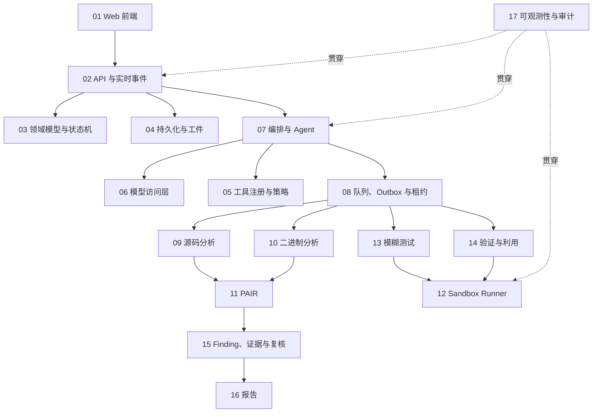

# 基于大模型智能体的软件漏洞挖掘系统——实现模块拆分

**项目名称：VulnWeaver（漏洞织鉴）**
工程、Compose 项目和镜像统一使用 `vulnweaver` 标识。

## 1. 文档目的

本文依据《系统架构设计与技术选型》将系统拆分为可独立开发、测试和验收的实现模块，并给出模块边界、依赖关系、建议目录与分阶段交付顺序。

所有程序代码、配置、数据库迁移、自动化测试和容器编排文件统一放在 `code/` 目录中。根目录仅保留架构、模块拆分和 Agent 开发上下文等项目文档。

## 2. 实现边界与强制约束

### 2.1 首版范围

- 输入：C/C++、Python、Java 源码，以及 x86/x64 ELF、PE 二进制。
- 分析：源码结构解析、静态规则扫描、二进制识别与反编译、PAIR 归一、关键逻辑标定、候选漏洞生成和独立复核。
- 动态能力：隔离环境中的模糊测试、最小复现和可选利用验证。
- 输出：任务轨迹、Finding、证据链、Markdown/PDF/SARIF 报告。
- 交互：项目与工件管理、任务进度、调用链与伪代码查看、人工标注和报告下载。

### 2.2 不可破坏的架构约束

1. 控制面不得直接运行不可信样本，不得挂载 Docker Socket。
2. Sandbox Runner 是唯一可访问容器运行时并创建动态执行环境的组件。
3. Agent 只能产生结构化 `ActionPlan`，工具调用必须经过 Tool Registry 和 Policy Engine 校验。
4. 动态执行默认禁网，并限制 CPU、内存、进程、磁盘、运行时间和输出大小。
5. 原始工件不可变，派生工件必须记录哈希、父子关系、工具版本和生成配置。
6. 模型解释不能单独确认漏洞；`confirmed` Finding 必须关联可重复验证的强证据。
7. Redis 只承担队列、事件和短期状态，PostgreSQL 与工件存储是事实来源。
8. 单个 Job 失败允许 Task 以 `PARTIAL` 完成，成功 Job 不能因重试被重复执行。
9. 利用生成仅适用于 `confirmed` 且显式开启利用验证的 Finding。
10. 所有样本必须属于用户明确授权的本地样本或开源项目。

## 3. 代码目录规划

```text
code/
├─ apps/
│  ├─ web/                     # Svelte 5 前端
│  ├─ api/                     # FastAPI 接入层
│  ├─ orchestrator/            # LangGraph 编排服务
│  ├─ dispatcher/              # PostgreSQL Outbox -> Redis Streams
│  ├─ analysis-worker/         # 源码解析与静态分析
│  ├─ binary-worker/           # 二进制识别、反编译与符号分析
│  ├─ fuzz-worker/             # Linux 模糊测试
│  ├─ proof-worker/            # 最小复现与利用验证
│  └─ sandbox-runner/          # 一次性沙箱运行控制
├─ packages/
│  ├─ domain/                  # 实体、枚举、状态机和领域规则
│  ├─ contracts/               # API、事件、Job、ActionPlan Schema
│  ├─ persistence/             # PostgreSQL、迁移、仓储与 Outbox
│  ├─ artifact-store/          # 本地/MinIO 工件存储适配
│  ├─ queue/                   # Redis Streams、租约与消费者组
│  ├─ pair/                    # PAIR 模型、导入、查询与路径固化
│  ├─ model-gateway/           # 应用内模型访问层
│  ├─ tool-runtime/            # Tool Registry、Policy Engine、适配器
│  ├─ observability/           # 日志、指标、事件和审计
│  └─ reporting/               # Markdown、PDF、SARIF
├─ tool-adapters/
│  ├─ source/                  # tree-sitter、Semgrep、cppcheck、Joern
│  ├─ binary/                  # DIE、UPX、Ghidra、angr
│  ├─ fuzz/                    # AFL++、WinAFL、CASR
│  └─ proof/                   # pwntools、Python/测试驱动
├─ migrations/                 # 数据库迁移
├─ deploy/
│  ├─ compose/                 # 开发/演示 Docker Compose
│  ├─ images/                  # 服务与工具镜像定义
│  └─ policies/                # seccomp、资源和网络策略
├─ tests/
│  ├─ unit/
│  ├─ integration/
│  ├─ contract/
│  ├─ e2e/
│  └─ fixtures/                # 无害、可公开的测试样本
├─ scripts/                    # 初始化、迁移和本地开发脚本
├─ pyproject.toml              # Python 工作区配置
├─ package.json                # 前端工作区配置
└─ compose.yaml                # 最小开发环境入口
```

首版可以将多个 Python 服务放入同一工作区和基础镜像，但服务进程、权限、队列消费者和部署单元必须保持分离。

## 4. 模块总览与依赖关系



## 5. 实现模块明细

### M01 Web 前端

**职责**

- 项目创建、样本上传、任务配置和启动。
- 任务列表、阶段状态、Job 重试、取消和实时事件展示。
- 函数/调用图/伪代码联动工作台。
- Finding、证据链、复核历史、Poc 结果和人工标注界面。
- 报告生成、预览和下载。

**关键实现**

- Svelte 5、TypeScript、Vite。
- 根据 OpenAPI 生成类型客户端，禁止手工复制后端 DTO。
- WebSocket 只消费进度、摘要和轨迹；大型内容按工件引用请求。
- 对二进制地址和源码行列使用不同的位置展示组件。

**验收标准**

- 能完整走通“创建项目—上传—启动—查看结果—导出报告”。
- WebSocket 断线后可依据最后事件序号恢复，不重复展示事件。
- 标注修改不会覆盖原始分析和历史复核记录。

### M02 API 与实时事件接入

**职责**

- 实现架构文档第 8 节的 HTTP/WebSocket 接口。
- 文件流式上传、输入 Schema 校验、幂等键和错误响应规范。
- 身份上下文、项目边界和资源访问控制预留。
- 读取数据库事实并向前端投递任务事件。

**关键接口域**

- `projects`、`artifacts`、`tasks`、`jobs`。
- `pair`、`agent-runs`、`findings`、`evidence`。
- `annotations`、`poc`、`exploits`、`reports`。

**验收标准**

- OpenAPI 契约测试通过；所有创建/变更接口支持幂等键。
- 大文件不整体读入内存；非法路径、归档炸弹和不支持格式被拒绝。
- API 进程不具备执行工具或连接容器运行时的代码路径。

### M03 领域模型、状态机与公共契约

**职责**

- 定义 Project、Artifact、ArtifactVersion、Task、Job、AgentRun、ToolRun、Finding、Evidence、Poc、Review 和 Annotation。
- 定义 Task/Job/Finding/Poc 状态枚举和合法迁移。
- 定义 `ActionPlan`、`ToolSpec`、`CapabilityProfile`、队列事件及 API DTO。
- 集中实现权限模式、部分成功、证据确认和幂等规则。

**重点规则**

- Task 汇总状态由 Job、Finding、Poc 聚合，不作为执行锁。
- Job 至少包含类型、输入引用、幂等键、预算、租约、重试策略和结构化失败原因。
- Finding 的确认操作必须通过 `FindingPolicy`。
- Schema 必须携带版本号，兼容滚动升级和历史任务回放。

**验收标准**

- 状态迁移、非法迁移、聚合状态和确认策略均有单元测试。
- Python、TypeScript 和消息队列使用同一契约源生成类型。

### M04 持久化与工件存储

**职责**

- PostgreSQL 表结构、索引、事务、迁移与仓储实现。
- LangGraph 检查点、Job 租约、Outbox 和任务事件持久化。
- 本地内容寻址工件存储；预留 MinIO 适配器。
- 工件上传、派生、哈希校验、父子关系和不可变性保护。

**核心数据组**

- 业务：Project、Task、Job、Finding、Review、Annotation、Poc。
- 运行：AgentRun、ToolRun、TaskEvent、OutboxEvent、JobLease。
- 工件：Artifact、ArtifactVersion、Evidence、FindingEvidence。
- PAIR：PairFunction、PairNode、PairEdge、PairRaw。

**验收标准**

- Job 与 Outbox 事件在同一事务提交。
- 相同内容写入得到相同摘要，任何覆盖已登记工件的操作被拒绝。
- 数据库故障恢复后可重放未投递 Outbox，不产生重复 Job。

### M05 工具注册表与策略引擎

**职责**

- 管理版本化 `ToolSpec`、镜像摘要、输入输出类型和命令参数 Schema。
- 校验工件类型、参数、网络、文件系统、资源、超时和重试策略。
- 处理 `REQUEST_PERMISSION` 与 `FULL_ACCESS`，记录许可决定。
- 将 Agent 的 `ActionPlan` 转换为可调度的结构化 Job，拒绝任意命令字符串。

**验收标准**

- 未登记工具、未知参数、宿主绝对路径、提权参数和越权网络请求全部被拒绝。
- `FULL_ACCESS` 只跳过宿主许可等待，不绕过白名单、禁网和资源限制。
- 每次策略判定都生成可查询的审计记录。

### M06 模型访问层

**职责**

- 封装 OpenAI 兼容协议，支持远程服务、本地 vLLM/Ollama 的配置切换。
- 按规划、批量审计、复核、报告等任务选择模型档位。
- 实现超时、重试、限流、结构化输出校验和降级。
- 记录提示哈希、输入工件清单、模型、token、耗时和结果引用。

**验收标准**

- 上层模块不依赖具体模型厂商 SDK。
- 模型输出不符合 Schema 时能够有限次修复，失败后返回结构化原因。
- 敏感内容脱敏策略可配置且有测试。

### M07 LangGraph 编排与智能体

**职责**

- 实现调度、导入解析、逆向分析、关键逻辑、静态审计、复核、模糊测试、验证、利用生成和报告智能体。
- 维护任务图、预算、检查点、中断恢复、失败降级和决策轨迹。
- 为静态审计与独立复核创建隔离上下文。
- 根据 `CapabilityProfile` 选择有效工具路径。

**核心节点**

1. 输入校验与能力探测。
2. 源码或二进制分析分支。
3. PAIR 构建和关键逻辑标定。
4. 候选 Finding 生成和独立复核。
5. 按需模糊测试/最小复现。
6. 按策略进行利用验证。
7. 证据归一、报告生成和结果聚合。

**验收标准**

- 任意节点可从持久化检查点恢复。
- 工具失败不清除已登记产物，能形成 `PARTIAL` 结果。
- 每个 Agent 决策可追溯到输入、提示哈希、输出和后续 Job。

### M08 队列、Outbox、Dispatcher 与 Worker 基础框架

**职责**

- PostgreSQL Outbox 到 Redis Streams 的可靠投递。
- 消费者组、ACK、死信流、租约领取/续约/接管和幂等执行。
- Worker 心跳、并发、优雅停止、取消和统一结果登记。
- TaskEvent 实时分发与持久化。

**验收标准**

- 模拟进程崩溃、ACK 丢失和消息重复时，成功 Job 仍只登记一次结果。
- 超时消息可由新 Worker 接管；超过上限进入死信流并保留原因。
- Worker 停止时不领取新任务，正在执行的任务可安全结束或释放租约。

### M09 源码导入、解析与静态分析

**职责**

- 安全解压和仓库导入，生成文件清单、语言和构建系统信息。
- tree-sitter 提取模块、类型、函数、参数、调用关系和源码位置。
- Semgrep、cppcheck 适配；Joern 作为可选扩展。
- 归一规则结果、数据流结果和工具错误，生成 `CapabilityProfile`。

**验收标准**

- C/C++、Python、Java 的最小样本均能产生函数索引和工具结果。
- 禁用 Git hooks、submodule、自动构建和依赖安装。
- 不可用分析器产生明确能力缺失原因，不使整个 Task 无条件失败。

### M10 二进制导入、逆向与解混淆

**职责**

- 检测 ELF/PE、x86/x64、编译器和壳/混淆特征。
- 受控调用 DIE、UPX、Ghidra Headless 和 angr。
- 产出函数、地址、文件偏移、反汇编、伪代码、字符串、Xref、CFG 和工具原始结果。
- 保留原始反编译结果，单独保存重命名、注释和结构归纳版本。

**验收标准**

- 普通 ELF/PE 样本能生成函数与地址映射。
- UPX 样本的原件和脱壳产物同时保留并建立父子关系。
- Ghidra 失败后仍能保存格式、字符串、导入表或反汇编等部分结果。

### M11 PAIR 构建、索引与查询

**职责**

- 将源码和二进制分析结果导入统一的 PairFunction/Node/Edge/Raw。
- 支持函数邻域、调用路径、数据流、控制流、Xref 和位置查询。
- 延迟解析大型 CFG，并缓存实际访问部分。
- 将 Finding 引用路径固化为不可变证据快照。

**验收标准**

- 同一查询接口能够返回源码位置或二进制地址位置。
- 所有节点和边可追溯至工件版本、工具版本及 Evidence。
- 原始结果重新导入具备幂等性。

### M12 Sandbox Runner

**职责**

- 接收通过策略验证的结构化运行请求。
- 创建一次性容器，挂载只读输入和独立输出目录。
- 实施禁网、非 root、只读根文件系统、capability drop、seccomp 和资源限制。
- 采集退出码、stdout/stderr、超时、资源用量和输出工件，完成哈希登记后销毁环境。

**验收标准**

- 不接受任意 Docker 参数、任意宿主路径和未登记镜像。
- 网络访问、越权文件访问、进程/内存/输出超限测试均被阻断。
- Runner 异常退出后能回收或识别孤儿容器，并保留审计事件。

### M13 模糊测试与崩溃分诊

**职责**

- AFL++ 源码插桩和 QEMU/Frida 二进制模式；预留独立 WinAFL Worker 协议。
- Harness 生成、编译诊断和限定次数的修正循环。
- 种子管理、覆盖率、运行预算、崩溃收集和最小化。
- CASR 与栈帧哈希聚类，生成崩溃 Evidence。

**验收标准**

- 可对无害测试目标完成受限时长 fuzz 并展示覆盖率与崩溃簇。
- Harness 多次失败后 Job 结构化失败，Task 可继续为 `PARTIAL`。
- 崩溃记录绑定样本哈希、镜像摘要、最小输入和调用栈。

### M14 漏洞验证与利用验证

**职责**

- 根据 Finding 生成最小复现，并只通过 Sandbox Runner 执行。
- 对满足条件的 Finding 生成 pwntools/Python/测试驱动形式的利用脚本。
- 记录 `Poc.result`、运行日志、实际控制效果和环境限制。
- 禁止脚本持久化、横向移动和访问外部网络。

**验收标准**

- 未确认或未开启利用验证的 Finding 无法创建 exploit Job。
- 验证失败只更新 Poc，不自动将已确认 Finding 改为误报。
- 每次运行可按保存的 recipe 在等价隔离环境中回放。

### M15 Finding、证据链、独立复核与标注

**职责**

- 归一多工具候选并去重，维护 Finding 生命周期。
- 管理 Evidence 以及 `supports | contradicts | contextual` 关系。
- 按漏洞类别执行 `FindingPolicy`，生成复核历史而非覆盖旧结论。
- 支持函数与漏洞人工标注、严重等级修正和争议状态。

**验收标准**

- 没有强证据的 Finding 无法进入 `confirmed`。
- 复核输入不直接包含静态审计智能体的推理文本，只包含可验证事实与必要上下文。
- 任一结论均能列出支持、反驳证据及其来源。

### M16 报告与结果交换

**职责**

- 生成 Markdown、WeasyPrint PDF 和 SARIF 2.1.0。
- 报告包含位置、调用/数据流、证据链、复核结论、Poc/利用结果、限制和修复建议。
- 将报告作为不可变派生工件登记。

**验收标准**

- `SUCCESS`、`PARTIAL`、`NO_FINDINGS` 三类结果均有清晰模板。
- SARIF 通过 Schema 校验；PDF 不遗漏关键证据引用。
- 报告不嵌入未截断的大型原始日志，只引用工件。

### M17 可观测性、安全审计与运维

**职责**

- 统一结构化日志、关联 ID、TaskEvent、AgentRun 和 ToolRun 审计字段。
- 记录模型 token/耗时、队列延迟、Job 成功率、工具失败率和资源消耗。
- 提供健康检查、就绪检查、备份恢复和日志保留配置。
- 可选接入 OpenTelemetry、Langfuse、MinIO 和 Qdrant。

**验收标准**

- 从 Task ID 可串联 API、编排、Worker、工具执行和报告生成全过程。
- 日志不泄露密钥、完整敏感样本或未经脱敏的模型输入。
- PostgreSQL 和工件存储完成一次恢复演练。

## 6. 横向公共能力

| 能力 | 负责模块 | 使用模块 |
|---|---|---|
| Schema 版本与代码生成 | M03 | 全部服务、前端 |
| 幂等键与事务 | M03、M04、M08 | API、编排、Worker |
| 工件不可变和内容寻址 | M04 | 所有分析/验证模块 |
| 策略判定与运行许可 | M05 | 编排、Worker、Runner |
| 任务事件与关联 ID | M08、M17 | 前端、API、全部后端 |
| 配置与密钥引用 | M17 | 全部服务 |
| 测试样本安全分级 | M12、M17 | 分析、fuzz、验证 |

## 7. 建议实施阶段

### P0 工程骨架与契约冻结

交付 M03 的基础契约、代码工作区、质量工具、测试框架和最小 Compose。冻结首版实体 ID、状态枚举、事件信封和错误格式。

完成条件：各服务可启动，契约测试和 CI 基线通过。

### P1 控制面最小闭环

实现 M02、M04、M08 的基础能力及 M01 的最小页面：项目、上传、Task/Job、Outbox、队列和实时进度。

完成条件：可以提交一个模拟分析任务，经队列执行后在页面看到完成状态和工件。

### P2 源码静态分析 MVP

实现 M05、M06、M07 基础版以及 M09、M11、M15 的源码路径。

完成条件：C/C++、Python、Java 测试项目可生成函数索引、候选 Finding、独立复核和证据链。

### P3 二进制分析 MVP

实现 M10 与 PAIR 二进制位置模型，补充逆向智能体和前端逆向工作台。

完成条件：ELF/PE 测试样本可展示函数、地址、伪代码、调用关系和部分失败信息。

### P4 隔离动态验证

实现 M12、M13、M14，先 Linux，再接入独立 Windows fuzz-worker。

完成条件：受控样本可完成 fuzz、崩溃归类、最小复现及策略允许的利用验证；越权测试全部被阻断。

### P5 报告、审计与加固

实现 M16、M17，完善 M01 的证据与报告交互，并执行故障恢复、安全和端到端测试。

完成条件：完整演示链路通过，可导出 Markdown/PDF/SARIF，故障可恢复，关键安全约束有自动化验证。

## 8. 首版任务包建议

| 编号 | 任务包 | 前置依赖 | 主要产物 |
|---|---|---|---|
| T01 | 初始化 Python/TypeScript 工作区 | 无 | 工程骨架、Lint、测试配置 |
| T02 | 领域实体、枚举与 Schema | T01 | M03 公共契约 |
| T03 | PostgreSQL 迁移与仓储 | T02 | M04 数据模型 |
| T04 | 本地内容寻址工件库 | T02 | artifact-store |
| T05 | Redis Streams 与 Outbox Dispatcher | T03 | M08 可靠投递 |
| T06 | Worker 租约和幂等框架 | T03、T05 | Worker SDK |
| T07 | FastAPI 项目/工件/任务接口 | T03、T04 | M02 基础 API |
| T08 | Svelte 项目与任务页面 | T07 | M01 基础 UI |
| T09 | ToolSpec 与 Policy Engine | T02 | M05 |
| T10 | 模型访问适配与运行记录 | T02、T03 | M06 |
| T11 | LangGraph 主流程与检查点 | T03、T09、T10 | M07 骨架 |
| T12 | 安全导入与 tree-sitter 索引 | T04、T06 | M09 导入解析 |
| T13 | Semgrep/cppcheck 适配 | T09、T12 | 静态工具结果 |
| T14 | PAIR 源码导入与查询 | T03、T12 | M11 源码路径 |
| T15 | Finding、Evidence 与复核 | T10、T13、T14 | M15 |
| T16 | DIE/UPX/Ghidra/angr 适配 | T04、T06、T09 | M10 |
| T17 | PAIR 二进制导入与查询 | T14、T16 | M11 二进制路径 |
| T18 | Sandbox Runner 安全基线 | T04、T09 | M12 |
| T19 | AFL++/CASR 与崩溃分诊 | T06、T18 | M13 |
| T20 | Proof/Exploit 流程 | T11、T15、T18 | M14 |
| T21 | Markdown/PDF/SARIF 报告 | T15、T20 | M16 |
| T22 | 全链路 UI、可观测性与 E2E | T08、T11、T17、T21 | M01、M17、验收报告 |

## 9. 测试策略

- **单元测试**：状态机、证据策略、参数 Schema、路径校验、哈希和解析转换。
- **契约测试**：OpenAPI、队列事件、ActionPlan、ToolSpec、Worker 输入输出的版本兼容。
- **集成测试**：PostgreSQL/Redis/工件存储、Outbox、租约接管、检查点恢复。
- **工具适配测试**：每个适配器使用固定版本、无害样本和黄金输出。
- **安全测试**：路径穿越、归档炸弹、符号链接、任意参数、镜像逃逸防护、网络/资源限制。
- **故障注入**：Worker 崩溃、Redis 暂停、数据库重连、模型超时、工具超时和磁盘配额耗尽。
- **端到端测试**：源码与二进制各至少一条 `SUCCESS`、`PARTIAL`、`NO_FINDINGS` 流程。

## 10. 完成定义（Definition of Done）

一个任务包只有同时满足以下条件才可标记完成：

1. 代码、配置、迁移和测试均位于 `code/` 下约定目录。
2. 实现未破坏第 2.2 节的架构与安全约束。
3. 公共接口已更新版本化 Schema 和契约测试。
4. 核心逻辑具有单元测试，跨组件行为具有集成或端到端测试。
5. 日志包含关联 ID，错误为结构化结果且不泄露敏感信息。
6. 新增配置有安全默认值、示例和说明。
7. `DEVELOPMENT_STATUS.md` 已同步更新当前进度、验证结果、问题、阻碍点、决策与下一步。
