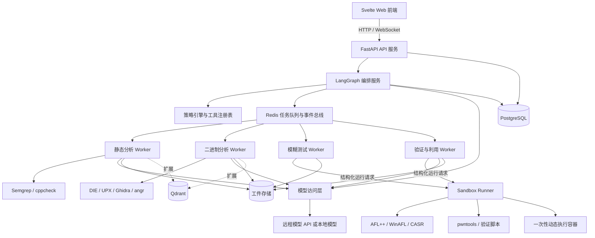
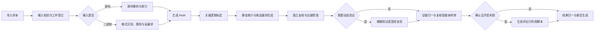
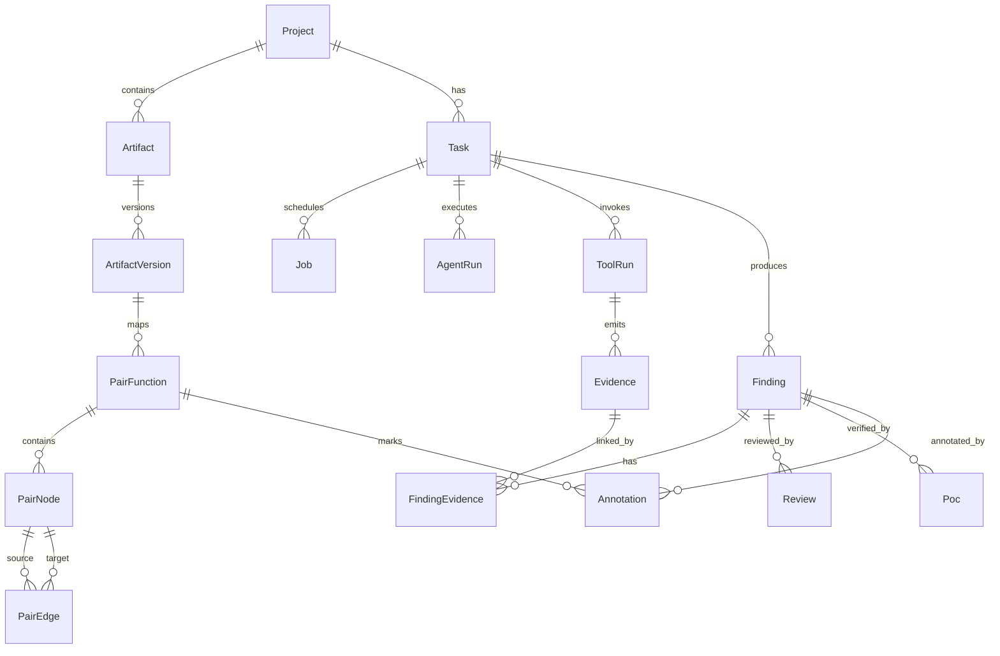

# 基于大模型智能体的软件漏洞挖掘系统架构设计与技术选型

**项目名称：VulnWeaver（漏洞织鉴）**
工程、Compose 项目和镜像统一使用 `vulnweaver` 标识。

## 1. 系统目标与边界

本系统面向已授权的源码仓库和二进制程序，利用大模型智能体编排静态分析、逆向分析、模糊测试与漏洞验证工具，完成从样本导入到报告输出的漏洞挖掘流程。

核心能力包括：

- 导入源码仓库、源码压缩包及 ELF/PE 二进制文件；
- 解析模块、函数、调用关系和数据流；
- 识别壳与混淆，执行脱壳、反编译和解混淆，生成可读代码或伪代码；
- 结合规则扫描、程序分析和大模型语义分析发现漏洞；
- 标定认证、加解密、注册校验等关键逻辑；
- 通过独立复核、模糊测试或受控复现过滤误报；
- 对已确认漏洞在隔离沙箱内生成利用脚本并验证可利用性；
- 保存漏洞位置、调用路径、工具输出和复现结果等证据；
- 支持人工复核、标注修正、任务回放、实时进度展示和报告导出。

系统仅分析用户明确授权的本地样本和开源项目。动态执行、模糊测试、受控复现及漏洞利用必须在隔离环境中进行，默认禁止访问外部网络。大模型输出只作为分析建议，不能单独作为漏洞确认依据。

## 2. 架构设计原则

1. **控制面与执行面分离**：API 和编排服务只管理任务，不直接运行不可信样本或安全工具。
2. **模型与工具分工**：大模型负责规划、语义理解和结果解释；程序分析工具负责生成可验证事实。
3. **源码与二进制分别适配**：两类输入使用不同分析管线，最终转换为统一程序分析中间表示。
4. **原始工件不可变**：源码、二进制、反汇编、伪代码和模型解释分别保存，生成内容不得覆盖原始内容。
5. **证据驱动结论**：已确认漏洞必须关联静态路径、崩溃记录、复现结果或人工确认等证据。
6. **工具执行受控**：工具调用经过参数校验、运行权限检查和资源限制；宿主运行时采用“请求许可”或“完全访问”模式。
7. **允许部分成功**：单个工具失败不丢弃已有结果，任务可输出部分完成状态。
8. **模型接入可替换**：模型访问通过统一接口封装，远程 API 与本地部署模型可配置切换，不绑定单一厂商或网关服务。

## 3. 总体架构



### 3.1 分层设计

| 层次 | 主要职责 | 核心组件 |
|---|---|---|
| 表现层 | 项目管理、逆向工作台、调用链展示、任务配置、进度与决策轨迹展示、复核标注与报告导出 | Svelte 5、TypeScript、Vite |
| 接入层 | 文件上传、任务接口、WebSocket 与 OpenAPI | FastAPI、Uvicorn |
| 编排层 | 状态机、智能体调度、重试、断点恢复和运行许可中断 | LangGraph |
| 策略层 | 工具白名单、参数校验、运行权限模式和资源配额 | Tool Registry、Policy Engine |
| 执行层 | 隔离运行静态分析、逆向、模糊测试和验证利用任务 | Docker、seccomp、任务 Worker |
| 模型层 | 模型接入、分级调用、超时重试和降级 | 应用内模型访问层、OpenAI 兼容接口 |
| 数据层 | 业务数据、工件、任务事件和检查点 | PostgreSQL、工件存储目录或 MinIO、Redis |
| 观测层 | 日志、指标、模型调用与智能体轨迹 | 结构化日志与任务事件表（OpenTelemetry、Langfuse 可选） |

### 3.2 控制面与执行面

控制面包括前端、API、编排、策略和数据库服务，负责接收请求、生成计划、调度任务及保存状态。控制面不挂载样本执行目录，也不具备直接执行任意命令的能力。

执行面由不同类型的 Worker 和 Sandbox Runner 组成。Worker 从队列领取结构化任务，通过只读输入目录读取样本，将输出写入独立工件目录。需要执行目标程序的 Job 由 Worker 提交给 Sandbox Runner；Sandbox Runner 是唯一能够访问容器运行时的组件，只接受通过 schema 校验的结构化运行请求，不接受任意 Docker 参数或宿主机路径。它为每次动态执行创建一次性容器，结束后销毁环境，只保留完成登记和哈希校验的结果。API、编排服务和普通 Worker 均不挂载 Docker Socket。

## 4. 核心业务流程



Task 保存流程汇总状态：

```text
CREATED -> VALIDATING -> ANALYZING -> REVIEWING
        -> VERIFYING -> EXPLOITING -> REPORTING -> COMPLETED
```

Task 状态由其 Job、Finding 和 Poc 状态聚合产生，不作为子任务执行锁。不同漏洞可以分别处于复核、验证和利用阶段。不需要动态验证或利用的任务跳过相应汇总状态；`EXPLOITING` 仅在漏洞被确认且利用开关开启时进入。终态包括 `COMPLETED`、`FAILED` 和 `CANCELLED`，完成结果另存为 `SUCCESS | PARTIAL | NO_FINDINGS`。状态变化写入事件表；重试不得重复执行具有相同幂等键的成功 Job。

系统不建立成员和角色模型。Agent 根据项目配置自主完成分析、动态验证和利用验证。宿主运行环境提供两种执行权限模式：`REQUEST_PERMISSION` 在命令、容器创建或受限文件访问被宿主拦截时请求一次运行许可；`FULL_ACCESS` 允许 Agent 在既定项目边界内连续执行。两种模式都不改变工具白名单、参数 schema、资源限制、禁网和工件审计规则。复核存在争议或证据不足时，Finding 标记为 `disputed` 或 `unverifiable`，不阻塞其他任务。

## 5. 智能体设计

智能体共享统一输入输出协议，不直接执行命令，只提交结构化 `ActionPlan`，经策略引擎检查后分发给 Worker。

| 智能体 | 主要职责 | 主要输出 |
|---|---|---|
| 调度智能体 | 拆分任务、选择分析路径、管理预算和失败降级 | 分析计划、子任务 |
| 导入解析智能体 | 识别项目结构、语言、依赖和二进制格式 | 工件清单、解析结果 |
| 逆向分析智能体 | 识别壳与混淆特征，自主规划脱壳、反编译和解混淆步骤 | 伪代码、函数及地址映射、决策轨迹 |
| 关键逻辑智能体 | 标定认证、加密、注册等关键逻辑 | 关键函数、调用路径、判定依据 |
| 静态审计智能体 | 合并规则、数据流和语义信号 | 候选 Finding |
| 复核智能体 | 检查漏洞前提、路径可达性及证据一致性 | 确认、误报、争议或不可验证结论 |
| 模糊测试智能体 | 生成或修正 harness，管理测试与崩溃分诊 | 覆盖率、崩溃簇、最小样本 |
| 验证智能体 | 生成并在沙箱中运行最小复现 | ProofRun、执行日志 |
| 利用生成智能体 | 对确认漏洞生成利用脚本并在沙箱内验证 | 利用脚本、利用运行记录 |
| 报告智能体 | 汇总漏洞、证据、复核和修复建议 | Markdown、PDF、SARIF |

逆向分析智能体自主规划分析步骤：是否脱壳、是否进入解混淆、反编译失败如何降级均由模型决策并记录理由，决策序列写入 AgentRun，在界面以轨迹形式展示。

静态审计智能体与复核智能体使用独立上下文。复核不能仅复述原结论，必须检查输入可控性、路径可达性、危险操作和保护条件是否同时成立。

利用生成智能体只处理状态为 `confirmed` 且项目已开启利用验证的 Finding，其输出作为不可变工件归入证据链。

## 6. 分析技术方案

### 6.1 源码分析

1. 校验归档路径、符号链接、文件数量、总大小和文件类型；
2. 使用 tree-sitter 提取模块、类、函数、参数和调用关系；
3. 使用 Semgrep 和 cppcheck 生成规则与数据流结果，Joern 代码属性图作为可选扩展；
4. 将语法结构、调用图、数据流和工具结果归一为 PAIR；
5. 按函数和调用邻域裁剪大模型上下文，可选引入向量索引支持语义检索；
6. 大模型对候选位置进行语义分析并给出判定依据。

代码检索以函数为基本单元，并附带文件路径、语言、符号名、调用者、被调用者和数据流标签。敏感内容在发送外部模型前按项目策略脱敏。

首版支持范围按输入类型固定，不以“任意源码仓库”作为无边界能力：

| 输入类型 | 结构解析 | 静态分析 | 数据流 | 动态验证 |
|---|---|---|---|---|
| C/C++ | tree-sitter、编译数据库 | Semgrep、cppcheck | Joern 或编译器 IR | AFL++、测试驱动 |
| Python | tree-sitter | Semgrep | 函数级污点摘要 | pytest/harness |
| Java | tree-sitter | Semgrep | Joern 或字节码分析结果 | JVM harness |
| x86/x64 ELF | Ghidra | 二进制规则与语义分析 | Ghidra、angr | AFL++ QEMU/Frida |
| x86/x64 PE | Ghidra | 二进制规则与语义分析 | Ghidra、angr | WinAFL/DynamoRIO |

导入阶段生成 `CapabilityProfile`，记录语言、架构、构建系统、可用分析器和无法执行的能力。任务只能调度 CapabilityProfile 中已解析成功的工具路径，某一路径不可用时必须产生结构化原因并计入 `PARTIAL` 结果。

### 6.2 二进制分析

1. 使用文件格式解析库和 Detect It Easy 识别格式、架构、编译器及壳特征，结合启发式特征识别控制流平坦化、虚假控制流等混淆（如大量分发基本块和不定向跳转）；
2. 对 UPX 样本使用 `upx -d`，其他壳只在策略允许时进入动态脱壳；
3. 使用 Ghidra Headless 提取函数、反汇编、伪代码、字符串、交叉引用和调用图；
4. 命中混淆特征时进入解混淆流程：优先使用基于 angr 的反扁平化脚本和 Ghidra 脚本恢复结构化控制流与符号；效果不足时由大模型对伪代码做结构归纳、变量重命名和注释，生成可读版本，原始反编译结果保留不改写；
5. 使用 angr 对少量关键函数执行定点符号分析；
6. 将地址、函数、基本块、控制流和伪代码映射到 PAIR；
7. 大模型解释难读伪代码并标定关键逻辑。

分析范围限定为 x86/x64 ELF 和 PE。反编译失败时保留反汇编、字符串、导入表和控制流等部分结果，任务标记为 `PARTIAL`。

### 6.3 统一程序分析中间表示 PAIR

PAIR 统一源码与二进制结果，避免将二进制伪代码当作普通源码处理。实现上不新建独立图存储，采用 PostgreSQL 关系表加工具原始输出存档：

```text
pair_function {
  id, artifact_version_id, name, symbol, language,
  source_location?, binary_location?, signature, attributes
}

pair_node {
  id, artifact_version_id, function_id?,
  kind: function | basic_block | instruction | parameter |
        variable | memory_object | source_location,
  location, attributes
}

pair_edge {
  id, source_node_id, target_node_id,
  type: call | control_flow | def_use | data_flow | taint | xref,
  scope, confidence, evidence_id
}

pair_raw {
  artifact_version_id, tool, format, object_ref
}
```

源码函数使用文件、行列和符号定位；二进制函数使用镜像基址、虚拟地址、文件偏移和指令范围定位。`pair_function` 保存函数摘要和检索字段，`pair_node` 与 `pair_edge` 表达基本块、指令、变量以及跨函数的数据流和污点路径。大规模完整 CFG 不强制全部展开，可在首次查询时从 `pair_raw` 解析并缓存；Finding 所引用的路径必须固化为 PAIR 节点、边和证据快照。每个节点关联具体工件版本和生成工具版本。

### 6.4 模糊测试、漏洞验证与利用生成

源码可构建时优先使用 AFL++ 编译插桩；闭源 ELF 二进制使用 QEMU 或 Frida 模式。PE 样本由独立 Windows fuzz-worker 使用 WinAFL 与 DynamoRIO 运行，Windows Worker 通过专用虚拟机或 Windows 容器与控制面隔离。模糊测试智能体生成 harness 后进入“编译—诊断—修正”循环；超过限定次数后保留诊断结果，将该 fuzz Job 标记为 `FAILED`，Task 可继续以 `PARTIAL` 结果完成。

崩溃由 CASR 和栈帧哈希去重，保存最小化输入、调用栈、信号、覆盖率和运行环境。

漏洞验证默认生成最小可复现证明。对复核确认且项目开启利用验证的漏洞，利用生成智能体进一步生成利用脚本：ELF 脚本优先使用 pwntools，PE 或非内存破坏类漏洞使用与目标环境匹配的 Python 脚本或测试驱动。脚本只在隔离沙箱内针对已登记的本地样本运行，验证漏洞可利用性并记录实际控制效果。利用代码禁止包含持久化、横向移动或访问外部网络的行为。

每次 ProofRun 或利用运行绑定样本哈希、镜像摘要、运行权限模式和资源限制，脚本、日志和结果作为不可变工件进入证据链。

### 6.5 Finding 与证据链

```text
Finding {
  id, task_id, cwe_id, title, severity, confidence,
  location, dataflow,
  status: candidate | confirmed | false_positive | disputed | unverifiable,
  evidence_ids, review_ids, poc_ids, fix_suggestion
}

Evidence {
  id, type, artifact_ref, digest,
  tool_name, tool_version, image_digest,
  input_ref, command_hash, exit_code,
  stdout_ref, stderr_ref, replay_recipe
}

Poc {
  id, finding_id, kind: proof_of_concept | exploit,
  script_ref, run_log_ref,
  result: exploitable | not_exploitable_under_environment |
          inconclusive | tool_error | environment_error |
          timeout | policy_denied,
  image_digest, permission_mode, resource_limits, created_at
}
```

Finding 与 Evidence 通过 `FindingEvidence` 多对多关联，关系类型为 `supports | contradicts | contextual`，并记录证据权重和创建来源。证据分为工具输出、代码片段、数据流路径、崩溃记录、复现结果、利用记录和复核结论。每个已确认漏洞至少关联一种可重复验证的强证据；模型解释不能单独将漏洞置为 `confirmed`。利用验证失败只更新 Poc 结果，不自动将已确认漏洞改为误报。生成利用的漏洞同时保存利用脚本与运行记录，并记录完整来源关系。

确认规则由 `FindingPolicy` 按漏洞类别配置：内存破坏要求可重复崩溃、可控输入和对应运行环境；注入类要求完整 source-to-sink 路径、保护条件分析和最小复现；认证或业务逻辑漏洞要求可达路径、条件约束和预期/实际行为差异；无法动态验证的静态漏洞要求独立工具证据与复核智能体结论一致。证据不足时只能标记为 `candidate`、`disputed` 或 `unverifiable`。

报告包含漏洞列表、严重等级、证据链、利用验证结果和修复建议。

## 7. 数据设计



| 实体 | 主要内容 | 用途 |
|---|---|---|
| Project | 名称、输入范围、工具策略、运行权限模式、资源预算 | 项目配置和分析边界 |
| Artifact/ArtifactVersion | 类型、哈希、父工件、存储引用、工具及配置版本 | 管理不可变输入和派生产物 |
| Task/Job | 状态、检查点、预算、Worker、重试和幂等键 | 管理编排及执行状态 |
| AgentRun/ToolRun | 模型、提示哈希、输入清单、决策轨迹、命令哈希、退出状态 | 保存分析过程与自主规划记录 |
| PairFunction/PairNode/PairEdge | 程序函数、基本块、指令、位置、控制流、调用和数据流关系 | 统一程序表示 |
| Finding/Evidence/FindingEvidence | 漏洞结论、证据、支持或反驳关系和回放方式 | 保存审计结果 |
| Poc | 复现或利用脚本、运行日志、权限模式与结果 | 支持漏洞验证与利用 |
| Annotation | 标注对象、标签、备注、严重等级修正、标注人与时间 | 支持人工标注修正 |
| Review | 独立复核结果、依据、模型与被替代版本 | 保存多轮复核历史 |

PostgreSQL 保存结构化业务数据和 LangGraph 检查点；工件存储默认使用宿主机本地目录并按哈希组织，生产环境可切换 MinIO，保存样本、工具输出、崩溃输入、利用脚本和报告；Qdrant 向量索引为可选扩展；Redis 仅保存任务队列、短期状态和实时事件，不作为最终事实来源。

## 8. 接口设计

| 方法 | 路径 | 功能 |
|---|---|---|
| POST | `/api/projects` | 创建项目 |
| POST | `/api/projects/{id}/artifacts` | 上传并校验源码或二进制工件 |
| GET | `/api/projects/{id}/artifacts/{artifact_id}` | 查询工件版本和来源关系 |
| POST | `/api/projects/{id}/tasks` | 创建分析任务 |
| GET | `/api/tasks/{id}` | 查询任务状态和资源使用 |
| POST | `/api/tasks/{id}/cancel` | 取消任务并保留已生成证据 |
| GET | `/api/tasks/{id}/pair` | 查询函数、调用图、控制流和地址映射 |
| GET | `/api/tasks/{id}/agent-runs` | 查询智能体规划与决策轨迹 |
| GET | `/api/tasks/{id}/annotations` | 获取函数与漏洞的人工标注 |
| POST | `/api/tasks/{id}/annotations` | 提交标注、备注和严重等级修正 |
| GET | `/api/tasks/{id}/findings` | 查询漏洞及复核状态 |
| GET | `/api/findings/{id}/evidence` | 查询证据链和回放信息 |
| PATCH | `/api/findings/{id}/review` | 可选提交人工复核修正 |
| POST | `/api/findings/{id}/poc` | 创建最小复现 Job |
| POST | `/api/findings/{id}/poc/replay` | 在隔离环境中重新验证 |
| POST | `/api/findings/{id}/exploit` | 为已确认漏洞创建利用验证 Job |
| GET | `/api/findings/{id}/exploits` | 查询利用脚本与运行结果 |
| POST | `/api/tasks/{id}/reports` | 创建 Markdown、PDF 或 SARIF 报告 Job |
| GET | `/api/tasks/{id}/reports` | 查询和下载已生成报告 |
| GET | `/api/tasks/{id}/jobs` | 查询 Job、重试次数和运行资源 |
| POST | `/api/jobs/{id}/retry` | 重试可恢复的失败 Job |
| GET | `/api/artifacts/{id}/content` | 按工件引用获取内容 |
| WS | `/ws/tasks/{id}` | 推送状态、日志、决策轨迹和阶段产物 |

所有创建和状态变更接口要求幂等键。上传文件、仓库地址、工具参数和模型输出均使用明确 schema 校验。验证与利用 Job 仅检查 Finding 状态、项目功能开关、运行权限模式和资源策略。WebSocket 只传输进度、摘要和决策轨迹事件，大型日志与工件通过工件存储引用获取。

前端工作台支持：点击函数高亮调用者与被调用者并联动伪代码与判定依据；展示智能体分析轨迹；对函数和漏洞提交标注修正。

## 9. 安全与可靠性设计

### 9.1 输入安全

- 限制上传大小、文件数、压缩层数和解压总体积；
- 拒绝路径穿越、危险符号链接和特殊设备文件；
- 仓库导入默认禁用 Git hooks、submodule、自动构建和依赖安装；
- 禁止访问内网、云元数据地址和未授权协议；
- 对所有输入及派生工件计算 SHA-256 并记录父子关系。

### 9.2 执行隔离

- Worker 使用非 root 用户、只读根文件系统、能力集删除和 seccomp；
- 动态执行一次一容器，默认禁网（`--network none`）；Linux 宿主机可叠加 gVisor 进一步加固，Windows/macOS 开发环境依赖 Docker Desktop 虚拟机隔离，不启用 gVisor；
- 限制 CPU、内存、进程数、磁盘、执行时间和输出大小；
- 控制面不挂载 Docker Socket，不直接访问样本进程；
- 工具输出按不可信数据处理，不能改变系统提示、策略或权限。

### 9.3 工具调用控制

```text
ToolSpec {
  name, version, image_digest, risk_level,
  accepted_artifacts, command_schema, output_schema,
  network_policy, filesystem_policy, resource_limits,
  approval_policy, timeout, retry_policy
}
```

策略引擎验证工具、输入工件、参数、网络、文件系统、资源预算和运行权限模式。未登记的工具或超出 schema 的参数不得执行。`REQUEST_PERMISSION` 模式下，宿主运行时拒绝尚未许可的命令或资源访问并将 Job 标记为 `WAITING_PERMISSION`；获得宿主许可后从检查点继续。`FULL_ACCESS` 模式下不产生许可等待，但仍执行容器隔离、禁网、资源限制和完整审计。

### 9.4 可靠性与可观测性

- LangGraph 检查点保存编排状态，Job 表保存执行状态；
- Task、Job、AgentRun 和 ToolRun 均具有唯一 ID、超时、取消状态和幂等键；
- Redis Streams 负责任务投递和实时事件。Worker 使用消费者组领取任务，成功持久化结果后 ACK；领取超时的消息按 Job 租约回收，超过重试次数进入死信流；
- PostgreSQL 使用 Outbox 表在同一事务中写入 Job 与待投递事件，由独立 dispatcher 投递到 Redis，避免数据库状态与队列消息不一致；
- Worker 定期续约 Job 租约；同一 Job 仅允许一个有效执行者，接管执行前检查幂等键和已登记工件；
- 工具失败按策略重试，持续失败时保留已有产物并标记部分完成；
- 通过结构化日志、任务事件表和 AgentRun 记录业务审计日志、工具日志、智能体决策轨迹和安全事件，可选接入 OpenTelemetry 与 Langfuse 补充调用链和模型成本分析；
- 资源预算覆盖模型 token、CPU、内存、磁盘、工具并发和动态执行次数；
- 模型调用支持超时、重试、限流和本地模型降级。

## 10. 技术选型

| 领域 | 选型 | 用途与依据 |
|---|---|---|
| 前端 | Svelte 5 + TypeScript + Vite | 构建任务管理、逆向工作台和审计界面 |
| API | FastAPI + Uvicorn | 异步接口、WebSocket 和 OpenAPI 支持完善 |
| 编排 | LangGraph 1.0 | 显式状态图、检查点、运行许可中断和恢复 |
| 任务队列 | Redis Streams + PostgreSQL Job/Outbox 表 | 消费者组负责投递与 ACK，数据库保存可靠状态并通过 Outbox 保证一致性 |
| 模型接入 | 应用内模型访问层 + OpenAI 兼容协议 | 统一访问远程模型与本地 vLLM/Ollama，配置化切换、重试和降级，不引入独立网关服务 |
| 工具接入 | MCP + CLI 适配器 | 统一工具描述，同时兼容现有命令行工具 |
| 源码解析 | tree-sitter | 结构化提取多语言代码单元 |
| 静态分析 | Semgrep CE + cppcheck | 组合规则扫描与编译语言检查；Joern 代码属性图作为可选扩展 |
| 二进制分析 | Detect It Easy + UPX + Ghidra Headless + angr | 格式识别、脱壳、反编译、解混淆和定点符号执行 |
| 模糊测试 | AFL++ + CASR | 覆盖引导测试、崩溃收集与去重 |
| 漏洞复现与利用 | pwntools | 构造最小复现与利用脚本 |
| 关系表示 | PAIR（PostgreSQL 表 + 工具原始输出存档） | 轻量统一源码位置、二进制地址、控制流和数据流 |
| 结果交换 | SARIF 2.1.0 | 导入和导出多工具静态分析结果 |
| 主数据库 | PostgreSQL 16 | 保存任务、漏洞、复核、标注、Outbox 和检查点 |
| 对象存储 | 本地工件目录，生产可切换 MinIO | 保存不可变样本、日志、崩溃输入、利用脚本和报告 |
| 向量检索 | Qdrant + BGE-M3（可选） | 函数级代码检索与中英文语义索引 |
| 隔离运行 | Docker + seccomp（gVisor 可选） | 隔离不可信分析和动态执行任务 |
| 可观测性 | 结构化日志 + 任务事件表 | 系统日志、智能体轨迹与审计；OpenTelemetry 和 Langfuse 可选接入 |
| 报告 | Markdown + WeasyPrint + SARIF | 输出可读报告、PDF 和标准交换文件 |

模型接入不引入独立网关服务。模型访问层作为应用内公共模块，统一封装：

- 通过 OpenAI 兼容协议访问远程模型 API 与本地部署模型（vLLM、Ollama 等）；
- 按任务类型配置模型档位：规划与终审用强模型，批量语义审计用快速模型；
- 超时、重试、限流和失败降级：远程模型不可用时切换本地模型或挂起任务等待；
- 调用日志与 token 用量写入 AgentRun，支撑成本统计；
- 是否部署本地模型只影响配置文件，不影响代码结构。

后端采用 Python，因为 LangGraph、angr、pwntools、Ghidra 自动化和主流模型 SDK 均具有成熟的 Python 支持，可减少跨语言适配成本。前后端通过 OpenAPI 生成 TypeScript 类型客户端，不额外引入 RPC 框架。

## 11. 部署结构

开发和演示环境使用 Docker Compose：

| 服务 | 数量 | 说明 |
|---|---:|---|
| web | 1 | Svelte 静态前端 |
| api | 1 | FastAPI 接口与 WebSocket |
| orchestrator | 1 | LangGraph 编排和智能体调度 |
| analysis-worker | 1..N | 源码静态分析任务 |
| binary-worker | 1..N | 反汇编、反编译、解混淆和符号分析任务 |
| proof-worker | 0..N | 受控验证与利用执行任务 |
| fuzz-worker | 0..N | 资源密集型模糊测试任务 |
| windows-fuzz-worker | 0..N | 在独立 Windows 执行环境中运行 PE 模糊测试 |
| sandbox-runner | 1..N | 创建和回收一次性动态执行环境，是唯一连接容器运行时的组件 |
| postgres | 1 | 业务数据与检查点 |
| redis | 1 | 队列、事件和短期缓存 |
| minio | 0..1 | 工件与报告存储，默认使用本地工件目录 |
| qdrant | 0..1 | 代码向量索引，可选 |
| langfuse | 0..1 | 模型与智能体调用追踪，可选 |

最小部署包含 web、api、orchestrator、analysis-worker、binary-worker、proof-worker、sandbox-runner、postgres、redis 共 9 个服务。启用 PE 模糊测试时增加独立的 windows-fuzz-worker 执行节点。模型默认调用远程 API，离线环境以本地 vLLM 或 Ollama 提供同协议服务。Windows 开发环境通过 Docker Desktop 运行 Linux 容器，不启用 gVisor。

API、数据库和管理服务位于控制网络；Worker 位于独立分析网络。动态执行容器默认没有网络接口，只通过只读输入卷和受限输出卷交换数据。生产部署还需配置密钥管理、TLS、对象存储访问策略、数据库备份和日志保留周期。
